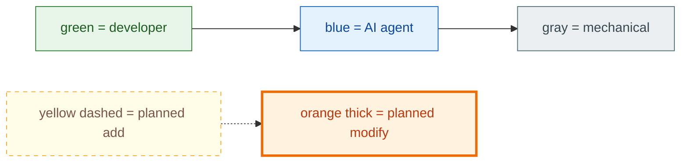
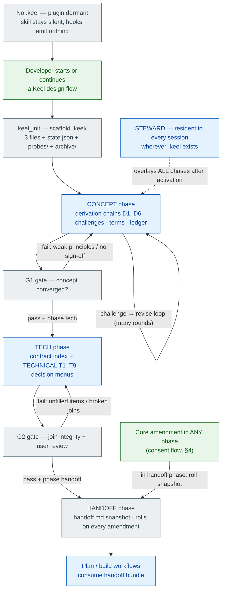
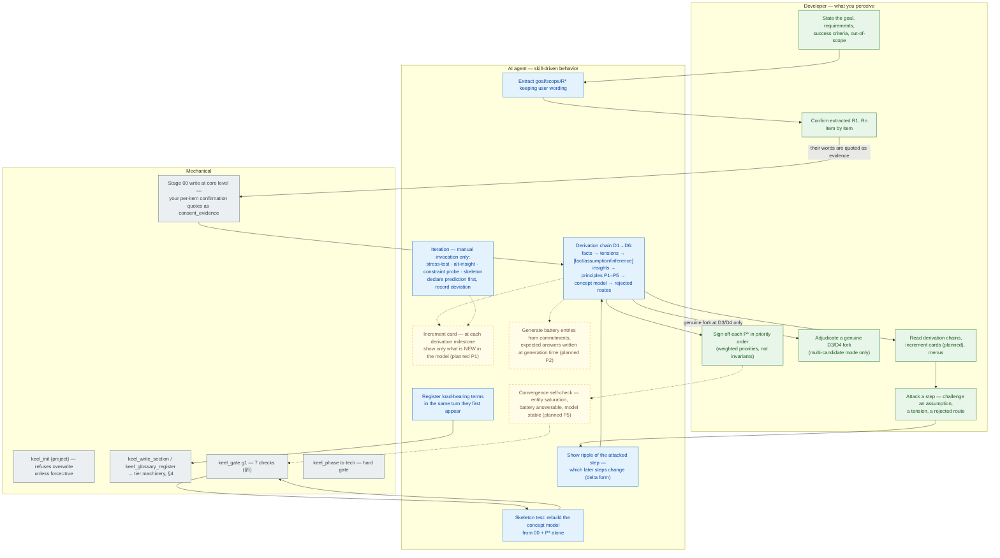
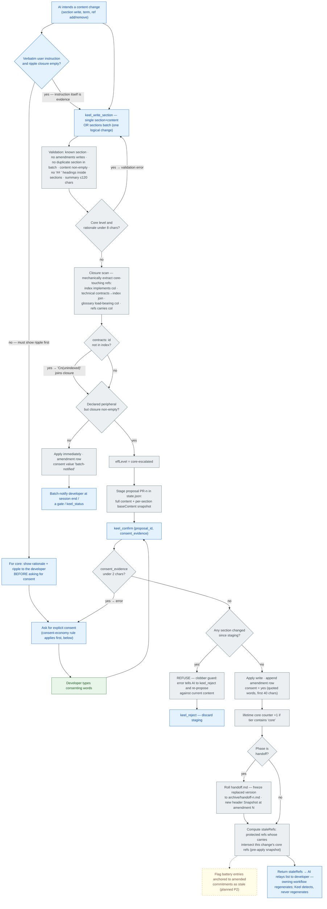
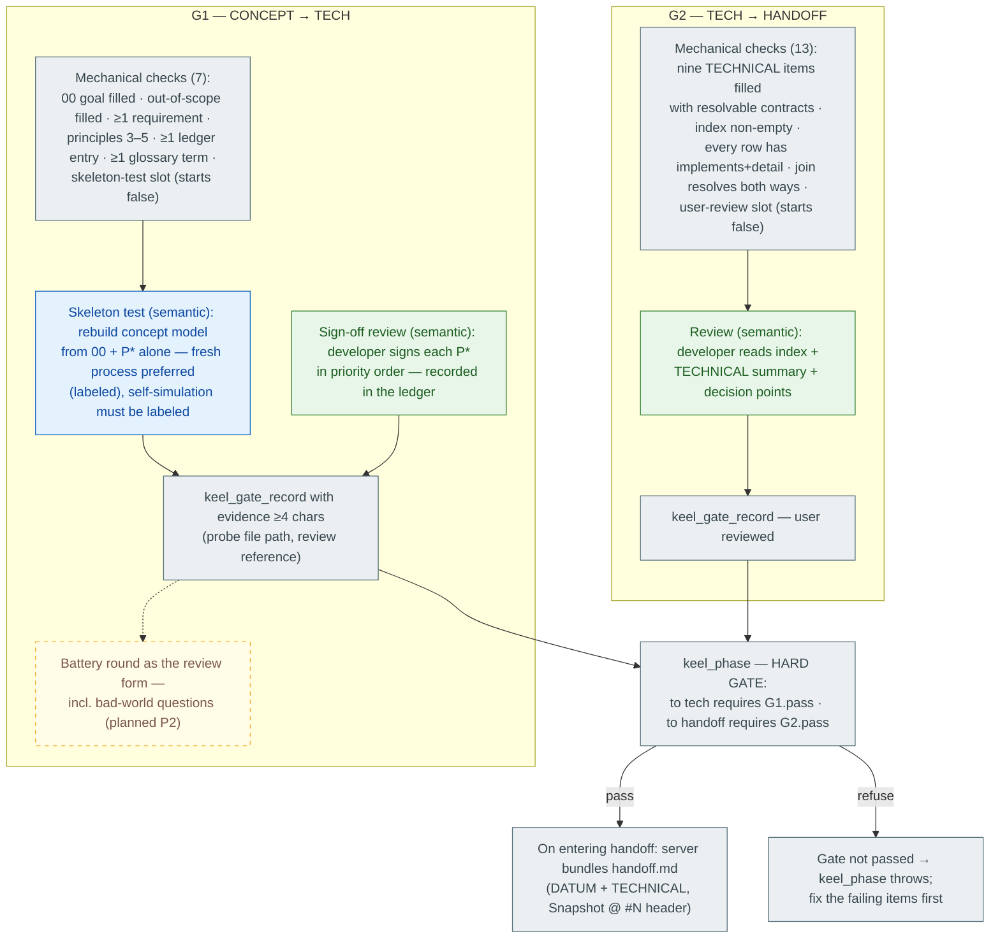
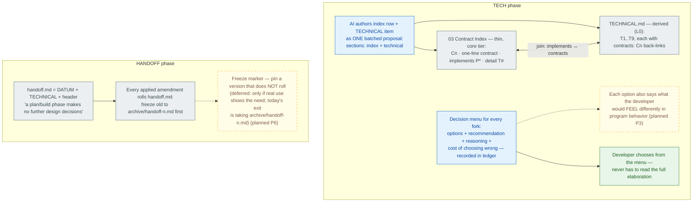
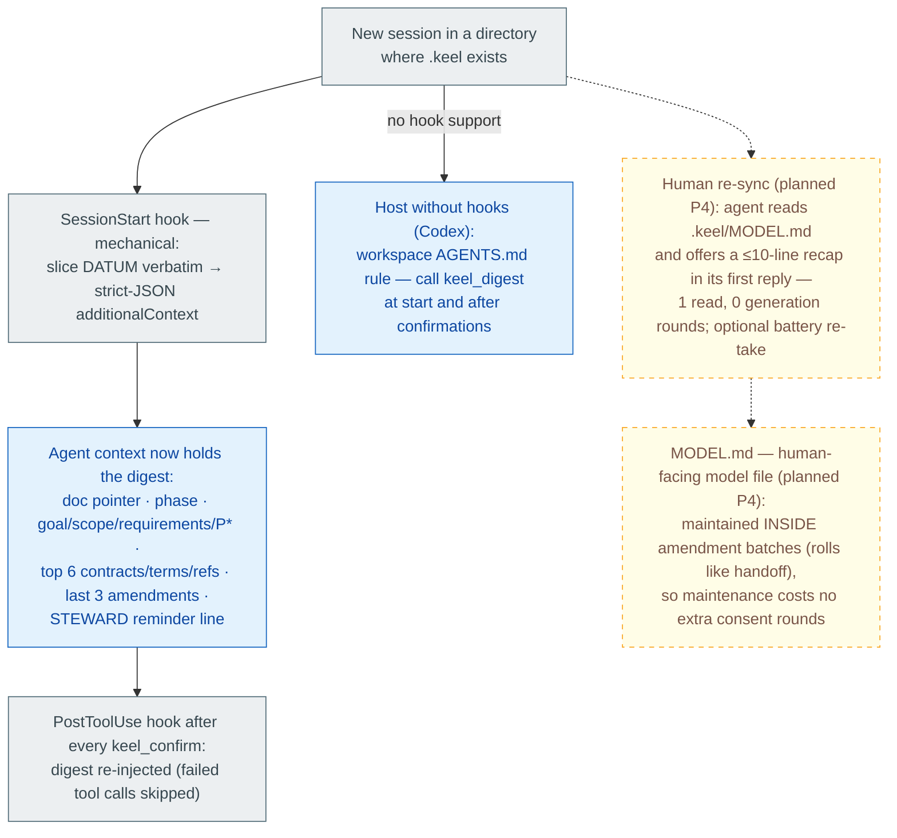
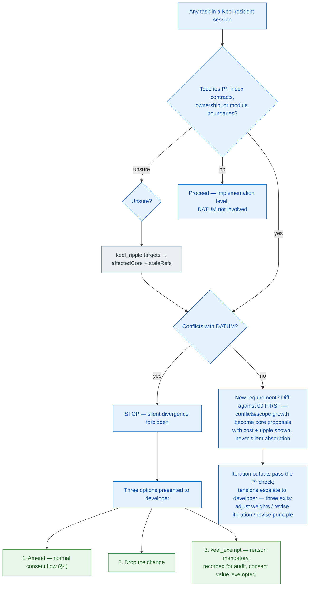
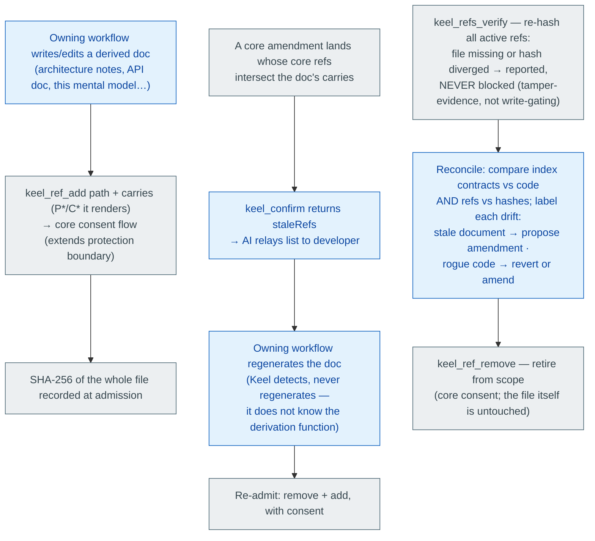

# Keel — Mental Model of the Whole Flow

> **One sentence.** Keel guards the part of a design that must never silently degrade: an authoritative DATUM of promises that only a consent-tiered server may write, where every change leaves an audit row, every session starts from the verbatim core, and every derived document is either protected or knowingly unprotected.

**Document contract.** This file is Keel's *mental model*: the developer-facing picture of how the whole thing runs. It is a derived document (protection level L0) — the source of truth is the code (`mcp/server.js`, `skills/`, `hooks/`) plus `docs/PROTOCOL.md`; if this file ever disagrees with them, **they win and this file gets fixed**. Updates may deepen sections, but must not silently overturn a claim made earlier — a changed claim is edited in place *and* gets a changelog line. Maps to **Keel v1.2.2**; planned changes are listed in §9 and drawn dashed.

---

## 0. How to read this file

### 0.1 Audience colors and change formats

Every node is colored by **who the step primarily serves**. Edge style tells you whether the flow exists today.

| Visual | Meaning |
|---|---|
| **Green fill** | Developer-facing — a human can perceive it (something you read, decide, or type) |
| **Blue fill** | AI-facing — agent cognition (prompted behavior, judgment, authorship) |
| **Gray fill** | Purely mechanical — server code or hooks; runs identically every time |
| Yellow fill, **dashed border** | Planned addition (does not exist yet) |
| Orange fill, thick border | Planned modification of an existing step |
| Solid arrow `──▶` | Flow exists in v1.2.2 |
| Dotted arrow `╌╌▶` | Planned flow |

Mixed steps are split into per-actor nodes (e.g. "AI asks for consent" is blue, "developer types the consenting words" is green, "server records the row" is gray), because the split itself is the point: it shows exactly where the human is in the loop.

### 0.2 Cold water first — five common misconceptions

1. **Misconception: the injected digest is for you.** It is for the *agent* — a verbatim slice so the AI starts each session holding the core. Your surface is the conversation (presentations, menus, consent requests), never the injection channel.
2. **Misconception: handoff.md "rolling forward" means old versions are lost.** Every rewrite first freezes the replaced version to `archive/handoff-<n>.md`. Nothing is ever deleted.
3. **Misconception: protected references block writes.** They are tamper-*evidence* (SHA-256, report-only), not write-gating. Only DATUM itself is write-gated.
4. **Misconception: high oscillation blocks progress.** The oscillation metric is a labeled reference value — it never gates anything and is never a threshold (explicit user decision).
5. **Misconception: you could ask the AI to just edit the files by hand.** It must refuse: every `.keel/` write goes through `keel_*` tools; the skill's iron rule 1 and the server's ownership of the log enforce it. Even `keel_write_section` on `amendments` is rejected.

---

## 1. Master lifecycle

Two things this coarse map hides and the detail sections show: the **write path** (§4) runs under every phase and is where consent happens; and **STEWARD's session bootstrap** (§7) is what makes the design survive across sessions.

---

## 2. What lives on disk

| Path | Protection level | Owner | What it is |
|---|---|---|---|
| `.keel/DATUM.md` | **L1 write-gated** | server (via consent flow) | The guarded core: `00 Intent` · `G Glossary` · `01 Concept (P1–P5 + concept model + parking lot)` · `02 Trade-off Ledger` · `03 Contract Index (thin)` · `R Protected References` |
| `.keel/TECHNICAL.md` | L0 derived | server | T1–T9 elaboration, each item back-linked `contracts: Cn` |
| `.keel/AMENDMENTS.md` | append-only | **server only** | Every change, one row: `# / time / tier / location / summary / supersedes / consent` |
| `.keel/handoff.md` | derived, rolls | server | DATUM + TECHNICAL bundle with `Snapshot @ amendment #N` header |
| `.keel/state.json` | internal | server | `phase` · `proposals` (staged) · `seq` counters · `gates` results · `coreCount` (lifetime) |
| `.keel/probes/` | evidence | AI writes, user reads | Skeleton-test outputs and other verification artifacts |
| `.keel/archive/` | frozen copies | server | `handoff-<n>.md`, `amendments-<n>.md` — never deleted |

**Who may touch what** (the whole safety argument in one matrix):

| Actor | DATUM / TECHNICAL / AMENDMENTS | state.json | probes/ |
|---|---|---|---|
| Developer | never directly — speaks consent words in conversation | — | reads |
| AI agent | only via `keel_*` tool calls; hand edits forbidden by iron rule | via tools | writes |
| Server | sole writer; validates, tiers, logs | sole writer | — |

Planned additions to this table (§9): `.keel/probes/battery.md` (P2) and `.keel/MODEL.md` (P4).

---

## 3. Activation & CONCEPT phase in detail

Rules the diagram compresses:

- **Derivation shape is mandatory** — every concept design is presented as a D1–D6 chain; a chain with no rejected alternative (D6 ≥ 1) is not trustworthy by protocol.
- **Challenge protocol**: attack → ripple (keel_ripple where contracts/terms are involved) → revised chain drafted as delta → core proposal → consent → confirm → ledger revision entry ("old belief → new evidence → new principle", `overturns` filled).
- **Requirement refinement co-evolves**: gaps the concept exposes go back into 00 as core proposals to the developer — never silently absorbed.
- **Altitude cap**: concept-phase output contains no class names, no stack choices; technical details that surface go to the 01 *parking lot*.
- **Battery (planned P2)** lives in `.keel/probes/battery.md`; the developer self-tests outside the conversation, and only divergences come back into it — see §9 for the format.

---

## 4. The write path & consent machinery (runs under every phase)

This is Keel's heart. Everything that changes `.keel/` flows through here.

Facts the diagram compresses:

- **What counts as core-touching**: a reference matching `^(P\d|01|00)` — a principle id, or a pointer into `01 Concept` / `00 Intent`. Everything else is peripheral unless escalated.
- **Batch = one logical change**: `sections:[{section,content},…]` — one consent, one amendment row, and the sections cannot drift apart between writes. The protocol *mandates* the batch form for index+technical changes and for any requirement change spanning 00+01+ledger.
- **Glossary and refs ride the same machinery**: `keel_glossary_register` computes the tier itself (load-bearing at P*/01/00 ⇒ core); `keel_ref_add` / `keel_ref_remove` always propose at core level (they change the protection boundary).
- **The anti-clobber guard fired live** in the Codex pilot: a second proposal staged on a section that had changed underneath was refused at confirm; the correct recovery (reject + re-propose) is what the error message itself instructs.
- **Consent economy (iron rule 2)**: the AI may treat a user message that specifies a change verbatim as consent **only** when it computed the ripple closure first and the closure is empty. Otherwise: stop, show the ripple — the developer may decide differently after seeing it.

---

## 5. Gates & phase transitions

The two semantic slots are deliberately *not* machine-checkable: the server marks them false and only `keel_gate_record` (with evidence) can turn them on. Everything else on the checklist is computed from the files.

---

## 6. TECH & HANDOFF

Two invariants worth pinning: `implements:` lives **only** in the index, `contracts:` **only** in TECHNICAL — the join is what makes ripple computable; and a `contracts:` id with no index row escalates the whole write to core (§4), so the two files cannot drift apart even by accident.

---

## 7. STEWARD — residency, drift defense, protected references, maintenance

### 7.1 Session bootstrap — two audiences, two channels

The digest's first line is the **document pointer** — any other workflow in the session can find the core and derive from it without Keel reading anything else.

### 7.2 Pre-edit check — the decision tree the agent runs before any task

### 7.3 Protected references — the L2 lifecycle

### 7.4 Maintenance

- **keel_clean** — orphan `## ` blocks (historical misplacements no tool can reach) are removed and logged as a maintenance row.
- **keel_compact** — refused below 5 rows; the AI supplies merged summary entries, the server archives the raw log *verbatim* to `archive/amendments-<n>.md` (never deleted) and rewrites the live log with compaction-summary rows. The **lifetime** core counter lives in state.json and survives compaction.
- **keel_health** — epoch count (since last compaction) + lifetime count, with the basis label; a yellow flag appears above 6 epoch core amendments ("concept may never have converged; consider re-running the skeleton test"). Oscillation (≥2 overturns at the same position) is reported as a **reference metric only**.
- **keel_status** — phase, gates, counts, pending proposals (abandoned stagings are visible here), batch notifications.

---

## 8. What the AI is told — resident prompt inventory

| # | Source | When it reaches the agent | Gist |
|---|---|---|---|
| 1 | Skill frontmatter `description` | tool/skill listing every session | Trigger conditions: user asks for Keel flow, mentions DATUM/index/protected refs/skeleton test, **or `.keel/DATUM.md` exists ⇒ resident STEWARD mode** |
| 2 | `SKILL.md` iron rules | on skill load | 1) semantics=AI, determinism=server, no hand edits; 2) consent tiers + explicit consent + consent economy; 3) concept→purpose→term, same-turn registration; 4) oscillation is reference-only; 5) concept altitude cap + parking lot; 6) protection ladder L0–L3, match response to layer |
| 3 | `SKILL.md` phase dispatch + quick ref | on skill load | which reference file per phase; `/keel status · check · protect · unprotect · reconcile` mappings |
| 4 | `references/concept.md` | entering CONCEPT | activation steps; D1–D6 mandatory shape; multi-candidate fork policy; challenge protocol; iteration set with declare-prediction-first; G1 steps incl. skeleton-test variants and labeling |
| 5 | `references/tech.md` | entering TECH | two-file split; **batch form mandated** for index+technical; implements/contracts placement; concreteness bar; decision-menu discipline; G2 steps; handoff note |
| 6 | `references/steward.md` | whenever `.keel` exists | bootstrap fallback (call keel_digest if no hooks); pre-edit check; three-option conflict rule; protected-refs lifecycle; reconcile two-direction labeling; maintenance triggers; altitude test |
| 7 | Hook-injected digest | SessionStart + after every confirm | verbatim slice (never AI-paraphrased): pointer, phase, goal/scope/requirements, P*, top 6 contracts/terms/refs, last 3 amendments, STEWARD reminder |
| 8 | Server tool descriptions + error messages | every call | each tool's contract; errors are instructive — e.g. the clobber error itself tells the AI to reject and re-propose; the staged-proposal result embeds the consent instruction |
| 9 | Workspace `AGENTS.md` (Codex adapter) | every session on hook-less hosts | "call keel_digest at session start and after confirmations" |

Planned prompt additions (§9): increment-card discipline (P1), battery protocol (P2), felt-consequence line in menus (P3), re-sync rule (P4), convergence heuristics (P5).

---

## 9. Planned changes register

Nothing here exists yet. **No deletions are planned.** Formats per §0.1.

| Id | Change | Type | Design notes |
|---|---|---|---|
| **P1** | Increment cards in derivation presentation | modify (concept protocol) | Each derivation milestone ends with a ≤5-line "model increment" — only NEW/changed entities, rules, failure modes. Working-memory-sized; density auto-reduces when the developer's predictions keep hitting. Not stored — it is conversation-state; D5 is what survives. |
| **P2** | Prediction battery — `.keel/probes/battery.md` | add (file + protocol) | Accumulating question battery per project. Entry format: question · expected answer in a collapsed `
` block · **anchor** (P*/C*/invariant it tests) · admitted date. Expected answers are written **at generation time** from DATUM commitments (preregistration — prevents fitting answers to the respondent). The developer self-tests outside the conversation; **only divergences enter it** (exception-only AI rounds — the round- and context-saving design). An answer that matches nothing in DATUM is a discovered undecided decision, not a question. When an anchored commitment is amended, affected entries go stale with the ripple. G1 review form: a battery round emphasizing bad-world (failure/concurrency/boundary) questions. Optional: consent_evidence may quote a battery answer, making the audit row double as comprehension evidence. |
| **P3** | Felt-consequence line in decision menus | modify (tech protocol) | Every option gets one sentence: what the developer would perceive differently in program behavior if chosen vs not. Decisions become answerable without holding the full technical model. |
| **P4** | Human re-sync — `.keel/MODEL.md` | add (file + protocol) | A human-facing model file maintained **inside amendment batches** (rolls like handoff.md — maintenance costs zero extra consent rounds). At session start the agent reads it and offers a ≤10-line recap in its first reply (one read, no generation round); optional battery re-take verifies the re-sync. **This file you are reading is the prototype** — `docs/MENTAL-MODEL.md` plays exactly this role for the Keel repo itself. |
| **P5** | Convergence self-check heuristics | modify (concept protocol) | Agent-side signals for "push convergence vs keep refining": entity saturation (two full rounds with no new entities/roles/states; arguing copy not rules), battery answerable in commitment voice, model stability. Counter-signal: anyone can say "if … then trouble" and nobody can answer. Reference heuristics, never gates. |
| **P6** | Freeze marker on rolling handoff | deferred add | Pin a handoff version that does NOT roll. Only if real use shows the need — today's exit is `archive/handoff-<n>.md`. |

---

## 10. Constants and rules Mermaid cannot show

- **Tier boundary regex**: a reference matching `^(P\d|01|00)` touches core. Everything else is peripheral unless closure-escalated.
- **Numeric constants**: consent evidence ≥ 2 chars (quoted to 40 in the row) · core rationale ≥ 8 chars · summary ≤ 120 chars · gate-record evidence ≥ 4 chars · exemption reason ≥ 4 chars · compaction refused below 5 rows · digest slices: top 6 index rows, top 6 terms, top 6 refs, last 3 amendments · yellow flag above 6 epoch core amendments.
- **The 19 tools**: init · digest · status · read · ripple · write_section · confirm · reject · gate · gate_record · phase · glossary_register · ref_add · ref_remove · refs_verify · clean · compact · exempt · health.
- **G2's nine TECHNICAL items**: module boundaries & responsibilities · interface contracts · data model · state machines · error & edge policy · stack choices & versions · acceptance criteria · non-functional constraints · risks & open items.
- **Semantics/determinism split**: the AI authors content, chooses wording, writes rationales, judges altitude; the server owns file creation, validation, tiering, staging, hashing, gates, phase enforcement, log appends, handoff rolls, digest slicing. Anything programmable is code, never a prompt request.
- **Host surface** (v1.2.2 lessons): plugin MCP is `<pluginRoot>/.mcp.json`, namespaced `plugin:keel:keel`; hook stdout must be strict JSON (`additionalContext`); all plugin paths anchor at `${CLAUDE_PLUGIN_ROOT}`; release gate = `tests/hostcompat.js` + `tests/smoke.js` (43 checks).
- **Failure modes and their exits**: abandoned staging → visible in `keel_status` pendingProposals, discard with `keel_reject` · orphan `## ` blocks → `keel_clean` · unindexed contracts id → automatic escalation at write time · protected-doc drift → `keel_refs_verify` report + regenerate + re-admit · corrupted state.json → defaults re-create a conservative state (phase concept) — recover from AMENDMENTS.md which is the durable history.

---

## Changelog

| Version | Date | Change |
|---|---|---|
| 1 | 2026-09-23 | Initial, maps Keel v1.2.2; planned register P1–P6 (P2 and P4 designs refined in discussion with the user on 2026-09-23). |
