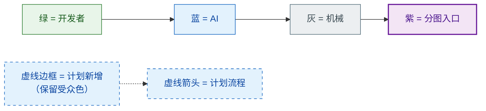
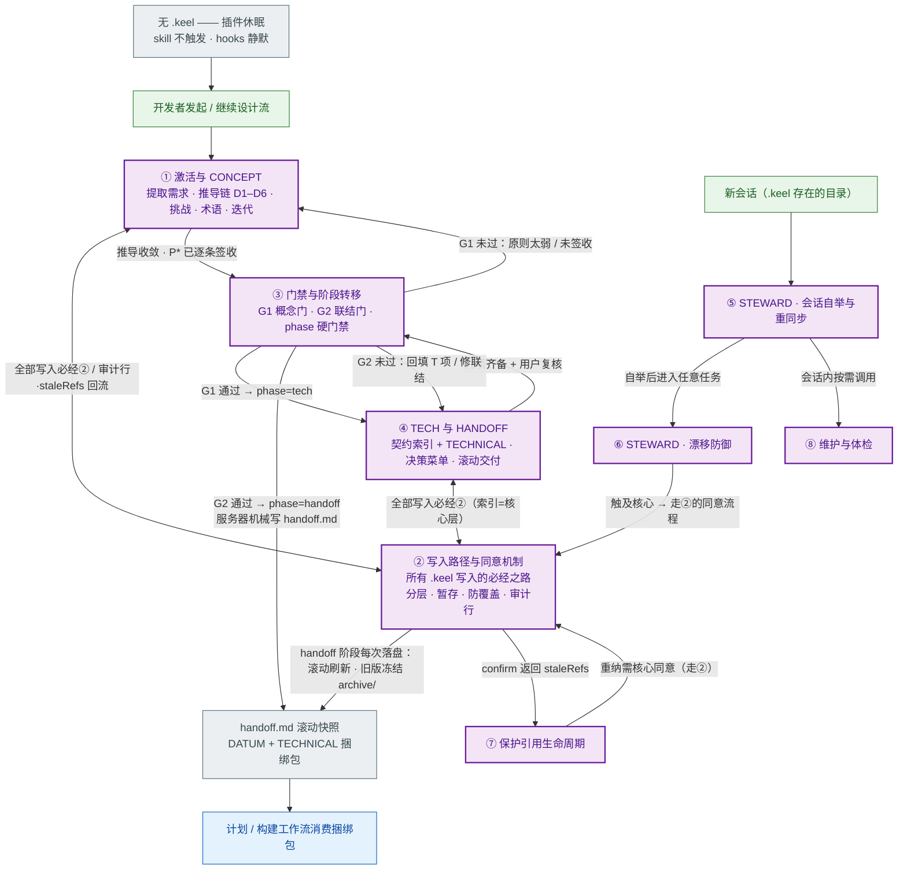
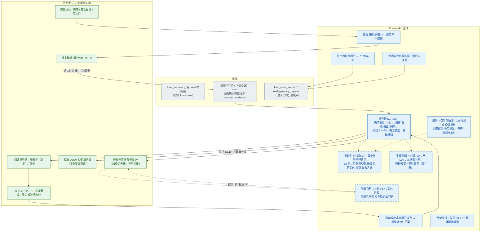
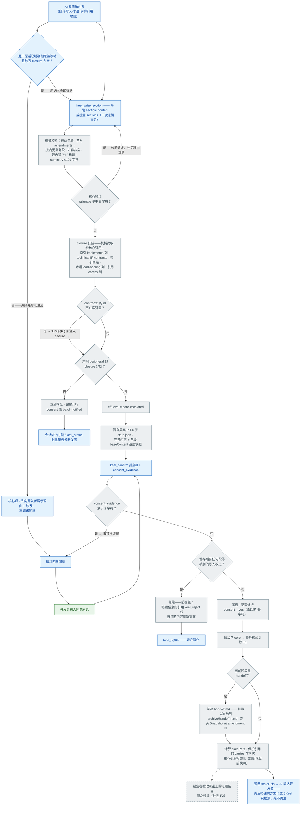
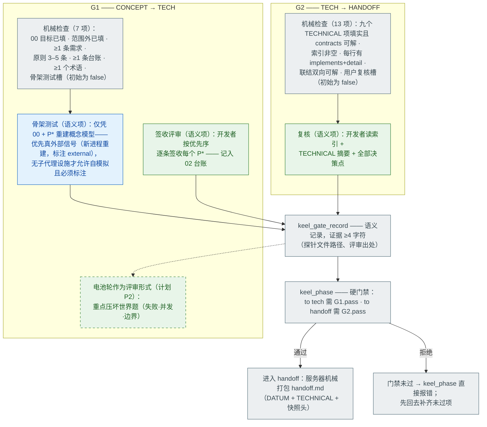
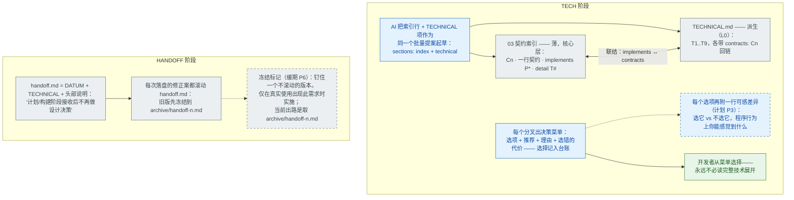
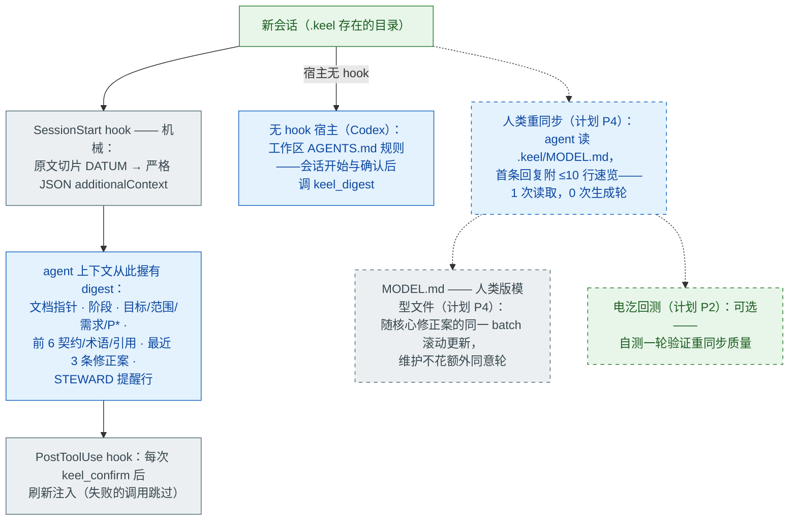
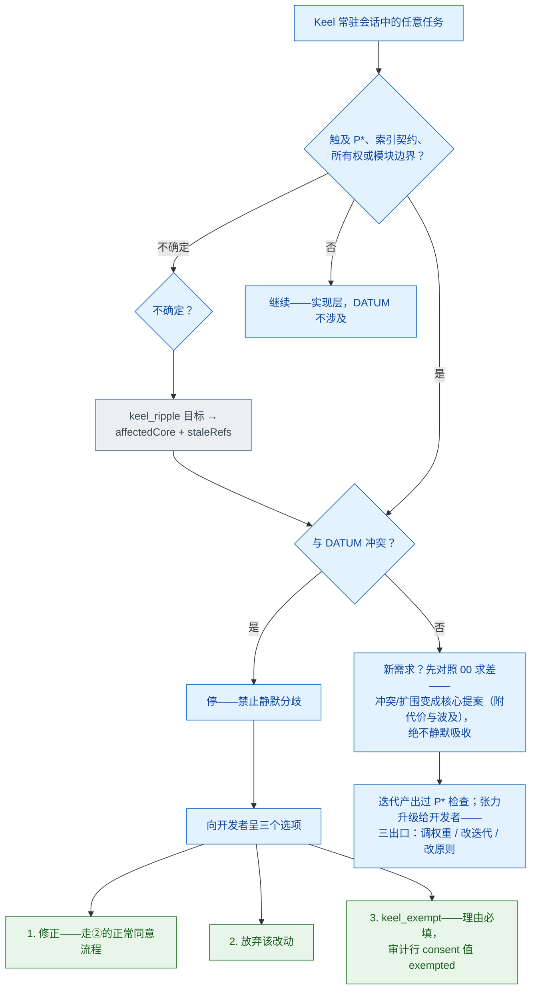
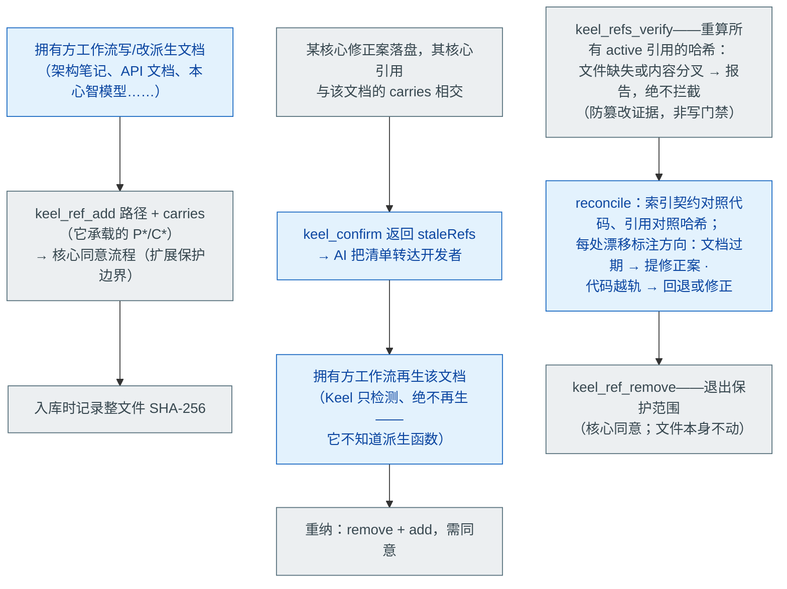
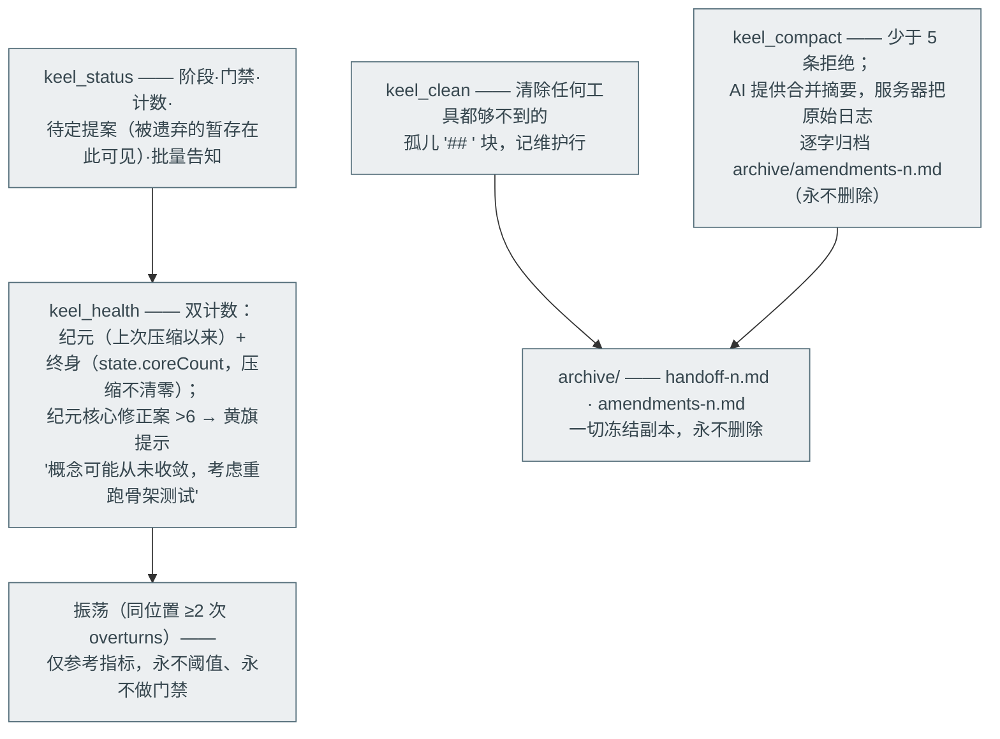

# Keel —— 全流程心智模型

> **一句话。** Keel 守护设计中绝不允许悄悄退化的那部分：一份只能经"分层同意服务器"写入的权威承诺文档（DATUM）——每次变更都留审计行，每个会话都从核心原文出发，每份派生物要么被保护、要么明确不设防。

**文档契约。** 本文件是 Keel 的*心智模型*：开发者视角的全流程图景。它是派生文档（保护级 L0）——真源是代码（`mcp/server.js`、`skills/`、`hooks/`）与 `docs/PROTOCOL.md`；若本文件与它们冲突，**代码赢，本文件修**。更新只许加深，不得静默推翻早先的断言；确需改写的断言，就地修改并记入文末变更表。对应 **Keel v1.2.2**；计划项集中列于 §12，并在各分图中以虚线呈现。

---

## 0. 怎么读这份文件

### 0.1 总-分结构（为什么这样组织）

这份文档是一张可缩放的地图：**§1 的总图是你脑中应常驻的那一层**——完整流程一图可见；可模块化的部分被抽离为**分图①–⑧**，在总图中各占一个**紫色节点**。紫色节点 = "此处放大见对应分图"。两层之间的桥就是编号：总图里的 ③ 和 §4 的分图③是同一个东西。读任何分图前先在总图里定位它，模型就不会断线。

总图只画**已存在**的流程；计划项全部在各分图内以虚线呈现（计划清单见 §12）——不把未来画成现状，是保持模型连续性的纪律。

### 0.2 颜色与线型规则

| 视觉 | 含义 |
|---|---|
| **绿色** | 开发者可感知——人会读到、决定或输入的步骤 |
| **蓝色** | AI 行为——受提示词驱动的判断与产出 |
| **灰色** | 纯机械——服务器代码或 hook，每次执行完全相同 |
| **紫色** | 分图入口——总图中代表一整张分图的位置 |
| 虚线边框（保留受众色） | 计划新增，尚不存在 |
| 粗边框（保留受众色） | 计划修改既有步骤——**必须显式写明"当前：… / 修改后：…"**（目前没有此类节点：现存全部计划项都是附加式，此规则为将来备用） |
| 实线箭头 | v1.2.2 已存在的流程 |
| 虚线箭头 | 计划中的流程 |

混合步骤拆成按角色的多个节点（"AI 请求同意"是蓝、"开发者输入同意原话"是绿、"服务器记审计行"是灰）——这个拆分本身就是重点：它显示人到底在环的哪里。

### 0.3 先泼五盆冷水（常见误会）

1. **误会：注入的 digest 是给你看的。** 它是给 *agent* 的——一段原文切片，让 AI 每个会话都握着核心。你的界面是对话（推导展示、菜单、同意请求），不是注入通道。
2. **误会：handoff.md "滚动"意味着旧版丢了。** 每次重写前，被替换的版本先冻结到 `archive/handoff-<n>.md`。任何东西都不删除。
3. **误会：保护引用会拦截写入。** 它是防篡改*证据*（SHA-256、只报告），不是写门禁。只有 DATUM 本身是写门禁。
4. **误会：振荡值高会卡流程。** 振荡是明确标注的参考值——永不作为阈值、永不触发门禁（用户明确决定）。
5. **误会：你可以让 AI 直接手改文件。** 它必须拒绝：所有 `.keel/` 写入走 `keel_*` 工具；skill 铁律 1 与服务器对日志的所有权共同保证。连对 `amendments` 的 `keel_write_section` 都会被拒。

---

## 1. 总图（常驻层）

总图压缩掉、由分图展开的三件事：**②** 是横切机制——CONCEPT/TECH/HANDOFF/build 任何阶段的写入都走它，同意就发生在这里；**⑤** 让设计跨会话存活；BUILD 之后 STEWARD 仍常驻（⑥挂在每个任务前）。

---

## 2. 分图①：激活与 CONCEPT

图压缩不掉的规则：

- **推导形状是强制的**——每个概念设计都以 D1–D6 链呈现；没有完整被拒路线（D6 ≥ 1）的推导按协议不可信。
- **挑战协议**：攻击 → 波及（涉及契约/术语时 `keel_ripple`）→ 增量式修订链 → 核心提案 → 同意 → confirm → 02 台账记修订条目（"旧信念→新证据→新原则"，填 `overturns`）。
- **需求共同演化**：概念暴露的缺口以核心提案的形式回到 00 提请开发者裁决——禁止静默吸收。
- **高度上限**：概念阶段产出不含类名、不含技术选型；细节进 01 *停车场*。
- **电题（计划 P2）**存于 `.keel/probes/battery.md`；开发者自测在对话之外进行，只有分歧回到对话里——格式与设计见 §12。

---

## 3. 分图②：写入路径与同意机制（横切所有阶段）

这是 Keel 的心脏。任何改变 `.keel/` 的东西都从这里走。

图压缩不掉的事实：

- **什么算触核心**：引用匹配 `^(P\d|01|00)`——原则 id，或指向 `01 Concept` / `00 Intent` 的引用。其余皆外围，除非被 closure 升级。
- **批量 = 一次逻辑变更**：`sections:[{section,content},…]`——一次同意、一行审计，且各段不会在两次写入之间漂移。协议*强制*索引+technical 用批量形式；跨 00+01+台账的需求变更同理。
- **术语与保护引用走同一机制**：`keel_glossary_register` 自行算层级（load-bearing 于 P*/01/00 ⇒ 核心）；`keel_ref_add` / `keel_ref_remove` 恒以核心层提案（它们改变保护边界）。
- **防覆盖守卫在实测中真实触发过**：Codex 试点中第二个提案因底层段落已变在 confirm 处被拒；正确恢复路径（reject + 重提）就写在错误信息里。
- **同意经济（铁律 2）**：仅当 AI 先算过波及 closure 且 closure 为空，才可把"逐字指定了改动"的用户消息当作同意。否则：停下、展示波及——开发者看完波及可能会改主意。

---

## 4. 分图③：门禁与阶段转移（G1 / G2 内部）

两个语义槽**故意**设计成机器查不了：服务器先标 false，只有带证据的 `keel_gate_record` 能点亮它们。清单上其余各项全部由文件内容计算得出。

---

## 5. 分图④：TECH 与 HANDOFF

值得钉住的两条不变量：`implements:` **只**住在索引里，`contracts:` **只**住在 TECHNICAL——这个联结是波及可计算的原因；没有索引行的 `contracts:` id 会让整个写入升级为核心（见②），所以两份文件连"意外地"漂开都做不到。

---

## 6. 分图⑤：STEWARD · 会话自举与跨会话重同步

两个读者、两条通道——同源不同投影。

digest 第一行是**文档指针**——会话里任何其它工作流都能凭它找到核心并派生，而无需 Keel 读别的东西。

---

## 7. 分图⑥：STEWARD · 漂移防御（每个任务前的决策树）

---

## 8. 分图⑦：保护引用生命周期（L2）

---

## 9. 分图⑧：维护与体检

---

## 10. 磁盘上有什么 + 谁能动什么

| 路径 | 保护级 | 所有者 | 是什么 |
|---|---|---|---|
| `.keel/DATUM.md` | **L1 写门禁** | 服务器（经同意流程） | 受保护核心：`00 Intent` · `G Glossary` · `01 Concept（P1–P5 + 概念模型 + 停车场）` · `02 Trade-off Ledger` · `03 Contract Index（薄）` · `R Protected References` |
| `.keel/TECHNICAL.md` | L0 派生 | 服务器 | T1–T9 展开，各项带 `contracts: Cn` 回链 |
| `.keel/AMENDMENTS.md` | 只追加 | **仅服务器** | 每次变更一行：`# / 时间 / 层级 / 位置 / 摘要 / 取代 / consent` |
| `.keel/handoff.md` | 派生，滚动 | 服务器 | DATUM + TECHNICAL 捆绑，带 `Snapshot at amendment N` 头 |
| `.keel/state.json` | 内部 | 服务器 | `phase` · `proposals`（暂存）· `seq` 计数 · `gates` 结果 · `coreCount`（终身） |
| `.keel/probes/` | 证据 | AI 写，人读 | 骨架测试输出等验证产物 |
| `.keel/archive/` | 冻结副本 | 服务器 | `handoff-<n>.md`、`amendments-<n>.md` —— 永不删除 |

**谁能动什么**（整个安全论证压在一张矩阵上）：

| 角色 | DATUM / TECHNICAL / AMENDMENTS | state.json | probes/ |
|---|---|---|---|
| 开发者 | 从不直接——只在对话里说同意原话 | — | 读 |
| AI | 只经 `keel_*` 工具；手改被铁律禁止 | 经工具 | 写 |
| 服务器 | 唯一写入者；校验、分层、记日志 | 唯一写入者 | — |

计划新增（§12）：`.keel/probes/battery.md`（P2）与 `.keel/MODEL.md`（P4）。

---

## 11. AI 收到了什么 —— 常驻提示词清单

| # | 来源 | 到达时机 | 要义 |
|---|---|---|---|
| 1 | skill 前置 `description` | 每会话的工具/技能列表 | 触发条件：用户点名 Keel 流程 / 提到 DATUM、索引、保护引用、骨架测试，**或 `.keel/DATUM.md` 存在 ⇒ 常驻 STEWARD 模式** |
| 2 | `SKILL.md` 铁律 | skill 加载时 | 1) 语义归 AI、确定性归服务器，禁止手改；2) 同意分层 + 明确同意 + 同意经济；3) 概念→目的→术语，同回合注册；4) 振荡仅参考；5) 概念高度上限 + 停车场；6) 保护阶梯 L0–L3，按层应对 |
| 3 | `SKILL.md` 阶段分派 + 速查 | skill 加载时 | 各阶段读哪份 reference；`/keel status · check · protect · unprotect · reconcile` 的映射 |
| 4 | `references/concept.md` | 进入 CONCEPT | 激活步骤；D1–D6 强制形状；多候选分叉策略；挑战协议；迭代集合与"先声明预测"；G1 步骤含骨架测试变体与标注要求 |
| 5 | `references/tech.md` | 进入 TECH | 两文件分工；索引+technical **强制批量**；implements/contracts 的归属；具体度标准线；决策菜单纪律；G2 步骤；handoff 说明 |
| 6 | `references/steward.md` | `.keel` 存在的任何时候 | 自举回退（无 hook 就调 keel_digest）；pre-edit 检查；冲突三选项；保护引用生命周期；reconcile 双向标注；维护触发；高度测试 |
| 7 | hook 注入的 digest | SessionStart + 每次 confirm 后 | 原文切片（绝非 AI 转述）：指针、阶段、目标/范围/需求、P*、前 6 契约/术语/引用、最近 3 条修正案、STEWARD 提醒 |
| 8 | 服务器工具描述 + 错误信息 | 每次调用 | 每个工具的契约；错误自带指引——防覆盖错误直接告诉 AI 去 reject+重提；暂存结果里内嵌同意指令 |
| 9 | 工作区 `AGENTS.md`（Codex 适配） | 无 hook 宿主的每个会话 | "会话开始与确认后调 keel_digest" |

计划中的提示词增补（§12）：增量卡纪律（P1）、电题协议（P2）、菜单可感差异行（P3）、重同步规则（P4）、收敛自检（P5）。

---

## 12. 计划变更登记（均不存在；无删除计划）

| Id | 变更 | 类型 | 设计要点 |
|---|---|---|---|
| **P1** | 推导展示中的增量卡 | 附加（AI 行为） | 每个推导里程碑附 ≤5 行"模型增量"——只列新增/改变的实体、规则、失败方式。工作记忆尺寸；开发者预测连续答对时自动降密度。不落盘——它是对话态；D5 是沉淀后的幸存部分。 |
| **P2** | 预测电题 —— `.keel/probes/battery.md` | 附加（文件 + 协议） | 每项目一份累积电题。条目格式：题目 · 预期答案（折叠 `
`）· **锚点**（所测的 P*/C*/不变量）· 收录日期。预期答案**出题时即写**（预注册——防止事后迁就答题者）。开发者对话外自测，**只有分歧进对话**（异常才升级——省轮次、净上下文）。锚不上的题=发现未决决策，不是坏题。锚定承诺被修正 → 相应条目随波及过期。G1 评审形态：一轮重坏世界的电题。可选：consent_evidence 引用电题答案，审计行同时是理解证据。 |
| **P3** | 决策菜单附可感差异行 | 附加（AI 行为） | 每个选项一句话：选它 vs 不选它，程序行为上你能感觉到什么。让没装完整技术模型的开发者也能决策。 |
| **P4** | 人类重同步 —— `.keel/MODEL.md` | 附加（文件 + 协议） | 人类版模型文件，**随修正案 batch 滚动**（同 handoff.md 的滚动逻辑——维护零额外同意轮）。会话开始时 agent 读它并在首条回复附 ≤10 行速览（1 次读取，0 次生成轮）；可选电汔回测验证。**本文件就是原型**——`docs/MENTAL-MODEL.md` 对 Keel 仓库扮演的角色，与 `.keel/MODEL.md` 将来对每个项目扮演的角色相同。 |
| **P5** | 收敛自检启发式 | 附加（AI 行为） | "该推收敛还是继续细化"的 agent 侧信号：实体饱和（连续两轮无新实体/角色/状态；争文案不争规则）、电题可全部以承诺口吻作答、模型稳定。反面信号：有人说"如果到时候……就麻烦了"而无人接得住。参考启发式，永不作门禁。 |
| **P6** | 滚动 handoff 的冻结标记 | 暂缓 | 钉住一个不滚动的版本。仅当真实使用出现需求——当前出路是 `archive/handoff-<n>.md`。 |

---

## 13. Mermaid 装不下的常量与规则

- **分层边界正则**：引用匹配 `^(P\d|01|00)` 即触核心。其余皆外围，除非被 closure 升级。
- **数值常量**：consent 证据 ≥2 字符（审计行引用前 40 字符）· 核心 rationale ≥8 字符 · summary ≤120 字符 · gate_record 证据 ≥4 字符 · 豁免理由 ≥4 字符 · 少于 5 条拒绝压缩 · digest 切片：前 6 索引行、前 6 术语、前 6 引用、最近 3 条修正案 · 纪元核心修正案 >6 亮黄旗。
- **19 个工具**：init · digest · status · read · ripple · write_section · confirm · reject · gate · gate_record · phase · glossary_register · ref_add · ref_remove · refs_verify · clean · compact · exempt · health。
- **G2 的九个 TECHNICAL 项**：模块边界与职责 · 接口契约 · 数据模型 · 状态机 · 错误与边界策略 · 技术选型与版本 · 验收标准 · 非功能约束 · 风险与未决项。
- **语义/确定性分工**：AI 写内容、措辞、理由，判断高度；服务器管文件创建、校验、分层、暂存、哈希、门禁、阶段强制、日志追加、handoff 滚动、digest 切片。凡可程序化者皆为代码，绝不交给提示词。
- **宿主面事实**（v1.2.2 的教训）：插件 MCP = `<pluginRoot>/.mcp.json`，命名空间 `plugin:keel:keel`；hook stdout 必须是严格 JSON（`additionalContext`）；所有插件路径锚定 `${CLAUDE_PLUGIN_ROOT}`；发布门禁 = `tests/hostcompat.js` + `tests/smoke.js`（43 项检查）。
- **失败模式与出口**：暂存被遗弃 → `keel_status` 的待定提案可见，用 `keel_reject` 丢弃 · 孤儿 `## ` 块 → `keel_clean` · 未索引契约 id → 写入时自动升级 · 保护文档漂移 → `keel_refs_verify` 报告 + 再生 + 重纳 · state.json 损坏 → 回 conservative 默认（阶段 concept）——从 AMENDMENTS.md（持久历史）恢复。

---

## 变更记录

| 版本 | 日期 | 变更 |
|---|---|---|
| 1 | 2026-09-23 | 初版，对应 Keel v1.2.2；计划登记 P1–P6（P2、P4 的设计于 2026-09-23 讨论中定型）。 |
| 2 | 2026-09-24 | 重构为总-分图结构：§1 总图常驻 + 分图①–⑧（总图中以紫色节点占位）；计划项改为"受众色 + 虚线边框"，停用黄/橙底色；新增粗边框规则（必须显式"当前/修改后"，目前无节点使用）；全文改为中文。 |
