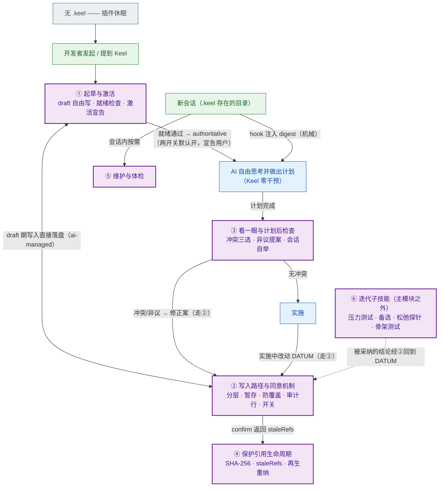
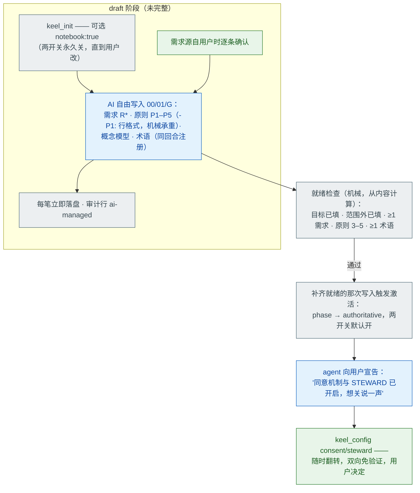
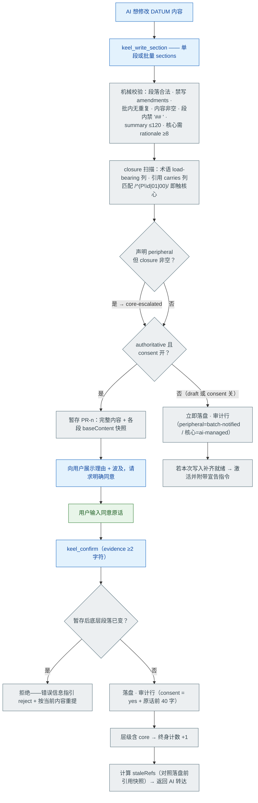
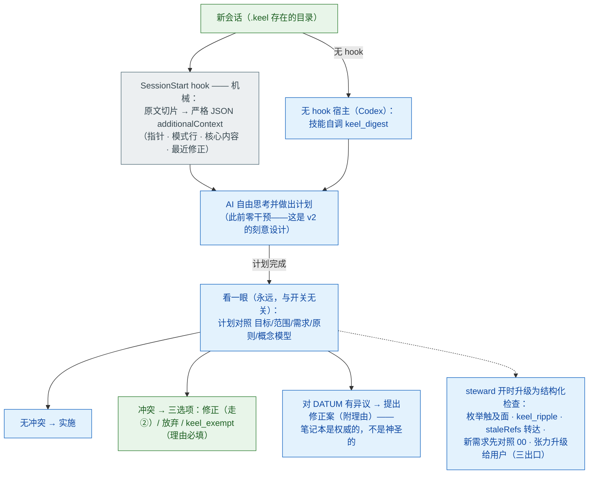
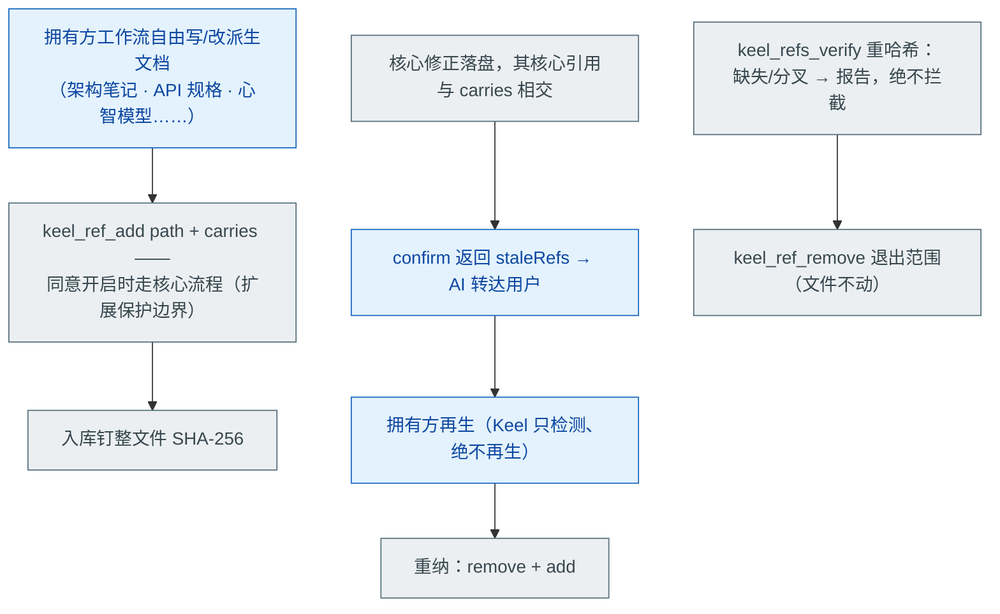
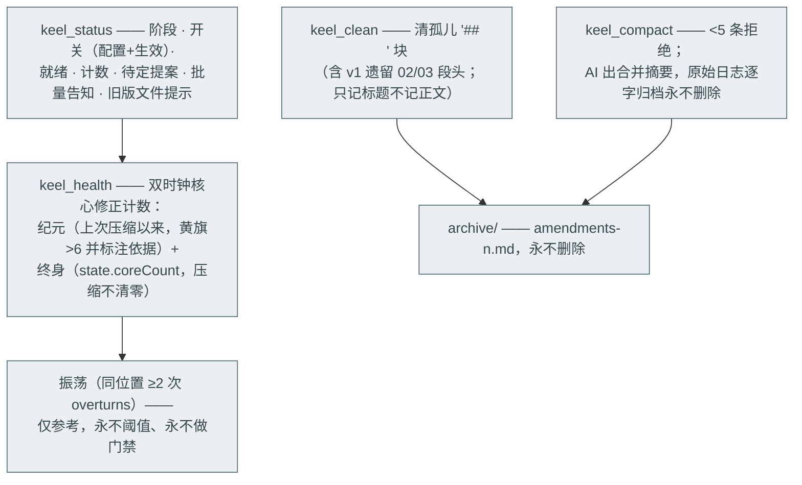
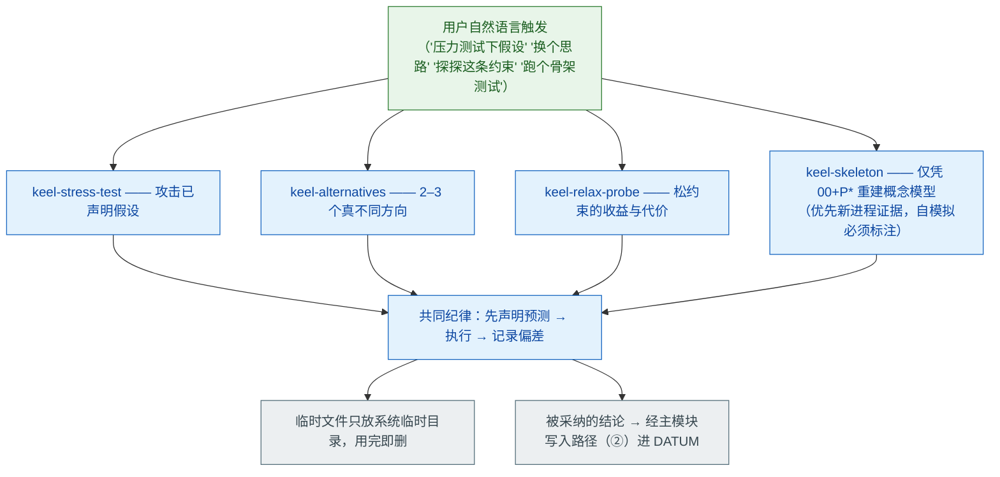

# Keel —— 全流程心智模型

> **一句话。** Keel 是 AI 的权威笔记本：一份只能经服务器写入的需求+概念模型记录（DATUM），防止跨会话的主题遗忘与静默漂移；AI 自由思考、自由计划，只在实施前"看一眼"。

**文档契约。** 本文件是 Keel 的*心智模型*：开发者视角的全流程图景。它是派生文档——真源是代码（`mcp/server.js`、`skills/`、`hooks/`）与 `docs/PROTOCOL.md`；若本文件与它们冲突，**代码赢，本文件修**。更新只许加深，不得静默推翻早先断言；改写的断言就地修改并记入文末变更表。对应 **Keel v2.0.0**（v1 的流程图见 git 历史，commit 277fb09）。

---

## 0. 怎么读这份文件

### 0.1 总-分结构

§1 的总图是常驻层——完整流程一图可见；可模块化部分抽为分图①–⑥，在总图中各占一个紫色节点。紫节点 = "此处放大见对应分图"，编号即桥。总图只画已存在的流程。

### 0.2 颜色与线型规则

| 视觉 | 含义 |
|---|---|
| **绿色** | 开发者可感知——人会读到、决定或输入的步骤 |
| **蓝色** | AI 行为——受提示词驱动的判断与产出 |
| **灰色** | 纯机械——服务器代码或 hook，每次执行完全相同 |
| **紫色** | 分图入口 |
| 虚线边框（保留受众色） | 计划新增，尚不存在（**当前没有计划项**——v2 重设计时 P1–P6 全部作废搁置；此格式留作未来用） |
| 粗边框（保留受众色） | 计划修改既有步骤——必须显式写明"当前：… / 修改后：…"（当前无使用） |
| 实线箭头 | 已存在；虚线箭头 = 计划中 |

```mermaid
flowchart LR
    A["绿 = 开发者"]:::human --> B["蓝 = AI"]:::ai --> C["灰 = 机械"]:::mech --> P["紫 = 分图入口"]:::mod
    classDef human fill:#e8f5e9,stroke:#2e7d32,color:#1b5e20
    classDef ai fill:#e3f2fd,stroke:#1565c0,color:#0d47a1
    classDef mech fill:#eceff1,stroke:#546e7a,color:#37474f
    classDef mod fill:#f3e5f5,stroke:#6a1b9a,color:#4a148c,stroke-width:2px
```

### 0.3 先泼四盆冷水

1. **误会：注入的 digest 是给你看的。** 它给 *agent*——原文切片让 AI 每会话握着笔记本。你的界面是对话。
2. **误会：consent 关了就没保护了。** 每笔写入仍记审计行（`ai-managed`）；丢掉的只是"等你点头"，不是记录。
3. **误会：激活（authoritative）会卡住自由书写。** 两开关随时可关（`keel_config`，双向免验证）；draft 阶段则天然全自由。
4. **误会：可以让 AI 手改文件。** 不行——所有 `.keel/` 写入走 `keel_*` 工具，服务器是唯一写入者（这是全部安全论证的根基）。

---

## 1. 总图（常驻层）

```mermaid
flowchart TD
    DORM["无 .keel —— 插件休眠"]:::mech
    START["开发者发起 / 提到 Keel"]:::human
    M1["① 起草与激活<br/>draft 自由写 · 就绪检查 · 激活宣告"]:::mod
    M2["② 写入路径与同意机制<br/>分层 · 暂存 · 防覆盖 · 审计行 · 开关"]:::mod
    WORK["AI 自由思考并做出计划<br/>（Keel 零干预）"]:::ai
    M3["③ 看一眼与计划后检查<br/>冲突三选 · 异议提案 · 会话自举"]:::mod
    IMPL["实施"]:::ai
    SESSION["新会话（.keel 存在的目录）"]:::human
    M4["④ 保护引用生命周期<br/>SHA-256 · staleRefs · 再生重纳"]:::mod
    M5["⑤ 维护与体检"]:::mod
    M6["⑥ 迭代子技能（主模块之外）<br/>压力测试 · 备选 · 松弛探针 · 骨架测试"]:::mod

    DORM --> START --> M1
    M1 -->|"就绪通过 → authoritative<br/>（两开关默认开，宣告用户）"| WORK
    M1 <-->|"draft 期写入直接落盘（ai-managed）"| M2
    WORK -->|"计划完成"| M3
    M3 -->|"无冲突"| IMPL
    M3 -->|"冲突/异议 → 修正案（走②）"| M2
    IMPL -->|"实施中改动 DATUM（走②）"| M2
    M2 -->|"confirm 返回 staleRefs"| M4
    SESSION -->|"hook 注入 digest（机械）"| WORK
    SESSION -->|"会话内按需"| M5
    M6 -.->|"被采纳的结论经②回到 DATUM"| M2
    classDef human fill:#e8f5e9,stroke:#2e7d32,color:#1b5e20
    classDef ai fill:#e3f2fd,stroke:#1565c0,color:#0d47a1
    classDef mech fill:#eceff1,stroke:#546e7a,color:#37474f
    classDef mod fill:#f3e5f5,stroke:#6a1b9a,color:#4a148c,stroke-width:2px
```

v2 与 v1 的本质差别浓缩在总图形状里：v1 是一条流水线（概念→技术→交付，门禁串行）；v2 是一个**环**——自由思考 → 计划 → 看一眼 → 实施 → 修正案 → 回到思考。守护只发生在一个接缝上（③），记录只发生在一个通道上（②）。

---

## 2. 分图①：起草与激活

```mermaid
flowchart TD
    subgraph D["draft 阶段（未完整）"]
    INIT["keel_init —— 可选 notebook:true<br/>（两开关永久关，直到用户改）"]:::mech
    FREE["AI 自由写入 00/01/G：<br/>需求 R* · 原则 P1–P5（- P1: 行格式，机械承重）·<br/>概念模型 · 术语（同回合注册）"]:::ai
    LOGD["每笔立即落盘 · 审计行 ai-managed"]:::mech
    CONF["需求源自用户时逐条确认"]:::human
    end
    READY["就绪检查（机械，从内容计算）：<br/>目标已填 · 范围外已填 · ≥1 需求 · 原则 3–5 · ≥1 术语"]:::mech
    ACT["补齐就绪的那次写入触发激活：<br/>phase → authoritative，两开关默认开"]:::mech
    TELL["agent 向用户宣告：<br/>'同意机制与 STEWARD 已开启，想关说一声'"]:::ai
    SW["keel_config consent/steward ——<br/>随时翻转，双向免验证，用户决定"]:::human

    INIT --> FREE --> LOGD
    CONF --> FREE
    FREE --> READY
    READY -->|"通过"| ACT --> TELL
    TELL --> SW
    classDef human fill:#e8f5e9,stroke:#2e7d32,color:#1b5e20
    classDef ai fill:#e3f2fd,stroke:#1565c0,color:#0d47a1
    classDef mech fill:#eceff1,stroke:#546e7a,color:#37474f
```

注意：激活是**机械事实**（内容补齐），不是仪式（v1 的 G1 签收门禁已删除）；notebook 项目的激活照常发生，只是开关保持关。

---

## 3. 分图②：写入路径与同意机制（横切所有阶段）

```mermaid
flowchart TD
    WANT["AI 想修改 DATUM 内容"]:::ai
    CALL["keel_write_section —— 单段或批量 sections"]:::ai
    VAL["机械校验：段落合法 · 禁写 amendments ·<br/>批内无重复 · 内容非空 · 段内禁 '## ' ·<br/>summary ≤120 · 核心需 rationale ≥8"]:::mech
    CLOS["closure 扫描：术语 load-bearing 列 · 引用 carries 列<br/>匹配 /^(P\\d|01|00)/ 即触核心"]:::mech
    ESC{"声明 peripheral<br/>但 closure 非空？"}:::mech
    GATE{"authoritative 且<br/>consent 开？"}:::mech
    STAGE["暂存 PR-n：完整内容 + 各段 baseContent 快照"]:::mech
    SHOW["向用户展示理由 + 波及，请求明确同意"]:::ai
    TYPE["用户输入同意原话"]:::human
    CONFIRM["keel_confirm（evidence ≥2 字符）"]:::ai
    CLOB{"暂存后底层段落已变？"}:::mech
    CLOBERR["拒绝——错误信息指引 reject + 按当前内容重提"]:::mech
    APPLY2["落盘 · 审计行（consent = yes + 原话前 40 字）"]:::mech
    LIFT["层级含 core → 终身计数 +1"]:::mech
    STALE["计算 staleRefs（对照落盘前引用快照）→ 返回 AI 转达"]:::mech
    APPLY["立即落盘 · 审计行<br/>（peripheral=batch-notified / 核心=ai-managed）"]:::mech
    ACT2["若本次写入补齐就绪 → 激活并附带宣告指令"]:::mech

    WANT --> CALL --> VAL --> CLOS --> ESC
    ESC -->|"是 → core-escalated"| GATE
    ESC -->|"否"| GATE
    GATE -->|"否（draft 或 consent 关）"| APPLY --> ACT2
    GATE -->|"是"| STAGE --> SHOW --> TYPE --> CONFIRM --> CLOB
    CLOB -->|"是"| CLOBERR
    CLOB -->|"否"| APPLY2 --> LIFT --> STALE
    classDef human fill:#e8f5e9,stroke:#2e7d32,color:#1b5e20
    classDef ai fill:#e3f2fd,stroke:#1565c0,color:#0d47a1
    classDef mech fill:#eceff1,stroke:#546e7a,color:#37474f
```

要点：批量 = 一次逻辑变更一次同意一行审计；同意经济（协议级）——用户逐字指定改动且 closure 为空时原话可作证据；术语与保护引用走同一机制（`keel_glossary_register` 自算层级；ref 增删恒核心层——同意开启时）。

---

## 4. 分图③：看一眼与计划后检查（含会话自举）

```mermaid
flowchart TD
    SESS["新会话（.keel 存在的目录）"]:::human
    HOOK["SessionStart hook —— 机械：<br/>原文切片 → 严格 JSON additionalContext<br/>（指针 · 模式行 · 核心内容 · 最近修正）"]:::mech
    FALL["无 hook 宿主（Codex）：<br/>技能自调 keel_digest"]:::ai
    PLAN["AI 自由思考并做出计划<br/>（此前零干预——这是 v2 的刻意设计）"]:::ai
    GLANCE["看一眼（永远，与开关无关）：<br/>计划对照 目标/范围/需求/原则/概念模型"]:::ai
    OK["无冲突 → 实施"]:::ai
    OPT["冲突 → 三选项：修正（走②）/ 放弃 / keel_exempt（理由必填）"]:::human
    DIS["对 DATUM 有异议 → 提出修正案（附理由）——<br/>笔记本是权威的，不是神圣的"]:::ai
    STRUCT["steward 开时升级为结构化检查：<br/>枚举触及面 · keel_ripple · staleRefs 转达 ·<br/>新需求先对照 00 · 张力升级给用户（三出口）"]:::ai

    SESS --> HOOK
    SESS -->|"无 hook"| FALL
    HOOK --> PLAN
    FALL --> PLAN
    PLAN -->|"计划完成"| GLANCE
    GLANCE --> OK
    GLANCE --> OPT
    GLANCE --> DIS
    GLANCE -.-> STRUCT
    classDef human fill:#e8f5e9,stroke:#2e7d32,color:#1b5e20
    classDef ai fill:#e3f2fd,stroke:#1565c0,color:#0d47a1
    classDef mech fill:#eceff1,stroke:#546e7a,color:#37474f
```

PostToolUse hook 在每次 keel_confirm 后刷新注入——长会话无需重启即跟踪设计。

---

## 5. 分图④：保护引用生命周期（L2）

```mermaid
flowchart TD
    WRITE["拥有方工作流自由写/改派生文档<br/>（架构笔记 · API 规格 · 心智模型……）"]:::ai
    ADMIT["keel_ref_add path + carries ——<br/>同意开启时走核心流程（扩展保护边界）"]:::mech
    PIN["入库钉整文件 SHA-256"]:::mech
    LANDS["核心修正落盘，其核心引用与 carries 相交"]:::mech
    STALE2["confirm 返回 staleRefs → AI 转达用户"]:::ai
    REGEN["拥有方再生（Keel 只检测、绝不再生）"]:::ai
    READMIT["重纳：remove + add"]:::mech
    VERIFY["keel_refs_verify 重哈希：<br/>缺失/分叉 → 报告，绝不拦截"]:::mech
    REMOVE["keel_ref_remove 退出范围（文件不动）"]:::mech

    WRITE --> ADMIT --> PIN
    LANDS --> STALE2 --> REGEN --> READMIT
    VERIFY --> REMOVE
    classDef human fill:#e8f5e9,stroke:#2e7d32,color:#1b5e20
    classDef ai fill:#e3f2fd,stroke:#1565c0,color:#0d47a1
    classDef mech fill:#eceff1,stroke:#546e7a,color:#37474f
```

---

## 6. 分图⑤：维护与体检

```mermaid
flowchart TD
    STATUS["keel_status —— 阶段 · 开关（配置+生效）·<br/>就绪 · 计数 · 待定提案 · 批量告知 · 旧版文件提示"]:::mech
    HEALTH["keel_health —— 双时钟核心修正计数：<br/>纪元（上次压缩以来，黄旗>6 并标注依据）+<br/>终身（state.coreCount，压缩不清零）"]:::mech
    OSC["振荡（同位置 ≥2 次 overturns）——<br/>仅参考，永不阈值、永不做门禁"]:::mech
    CLEAN["keel_clean —— 清孤儿 '## ' 块<br/>（含 v1 遗留 02/03 段头；只记标题不记正文）"]:::mech
    COMPACT["keel_compact —— <5 条拒绝；<br/>AI 出合并摘要，原始日志逐字归档永不删除"]:::mech
    ARCH["archive/ —— amendments-n.md，永不删除"]:::mech

    STATUS --> HEALTH --> OSC
    CLEAN --> ARCH
    COMPACT --> ARCH
    classDef mech fill:#eceff1,stroke:#546e7a,color:#37474f
```

---

## 7. 分图⑥：迭代子技能（主模块之外）

```mermaid
flowchart TD
    ASK["用户自然语言触发<br/>（'压力测试下假设' '换个思路' '探探这条约束' '跑个骨架测试'）"]:::human
    ST["keel-stress-test —— 攻击已声明假设"]:::ai
    ALT["keel-alternatives —— 2–3 个真不同方向"]:::ai
    RELAX["keel-relax-probe —— 松约束的收益与代价"]:::ai
    SKEL["keel-skeleton —— 仅凭 00+P* 重建概念模型<br/>（优先新进程证据，自模拟必须标注）"]:::ai
    PRED["共同纪律：先声明预测 → 执行 → 记录偏差"]:::ai
    TEMP["临时文件只放系统临时目录，用完即删"]:::mech
    BACK["被采纳的结论 → 经主模块写入路径（②）进 DATUM"]:::mech

    ASK --> ST
    ASK --> ALT
    ASK --> RELAX
    ASK --> SKEL
    ST --> PRED
    ALT --> PRED
    RELAX --> PRED
    SKEL --> PRED
    PRED --> TEMP
    PRED --> BACK
    classDef human fill:#e8f5e9,stroke:#2e7d32,color:#1b5e20
    classDef ai fill:#e3f2fd,stroke:#1565c0,color:#0d47a1
    classDef mech fill:#eceff1,stroke:#546e7a,color:#37474f
```

四个子技能有无 DATUM 都可用（skeleton 需要有）；它们对 DATUM 只读 + 经②写回，从不绕过。

---

## 8. Mermaid 装不下的常量与规则

- **分层边界正则**：`/^(P\d|01|00)/`。数值：consent 证据 ≥2 字符（审计行引前 40）· 核心 rationale ≥8 字符 · summary ≤120 字符 · 豁免理由 ≥4 字符 · <5 条拒绝压缩 · digest 切片：前 6 术语、前 6 引用、最近 3 条修正 · 纪元核心修正 >6 亮黄旗。
- **17 个工具**：init · digest · status · read · ripple · write_section · confirm · reject · config · glossary_register · ref_add · ref_remove · refs_verify · clean · compact · exempt · health。
- **谁能动什么**：开发者——只在对话里说同意原话；AI——只调 `keel_*`；服务器——`.keel/` 唯一写入者。
- **宿主面事实**：插件 MCP = `<pluginRoot>/.mcp.json`（`plugin:keel:keel`）；hook stdout 必须严格 JSON；插件路径锚 `${CLAUDE_PLUGIN_ROOT}`；发布门禁 = hostcompat + smoke（43 项）。
- **失败模式出口**：暂存遗弃 → status 可见 + reject · 孤儿块 → clean · 引用漂移 → verify 报告 + 再生重纳 · state.json 损坏 → 保守默认（draft），AMENDMENTS.md 是持久历史。
- **迁移**：v1 phase 自动映射（concept→draft，tech/handoff→authoritative）；TECHNICAL.md 与 02/03 段成为不受保护内容。

---

## 变更记录

| 版本 | 日期 | 变更 |
|---|---|---|
| 1 | 2026-09-23 | 初版（英文），对应 Keel v1.2.2，计划登记 P1–P6。 |
| 2 | 2026-09-24 | 重构为总-分图（紫节点）、去黄橙底色、新增粗边框规则、中文化。 |
| 3 | 2026-09-29 | 对应 Keel v2.0.0 全面重绘：流水线改为"自由思考→计划→看一眼→实施"的环；分图从 8 张重切为 6 张（①起草与激活 ②写入与同意 ③看一眼与计划后检查 ④保护引用 ⑤维护 ⑥迭代子技能）；v1 的计划项 P1–P6 全部作废（用户决定，含心智模型挂点搁置）；新增开关与激活机制。 |
