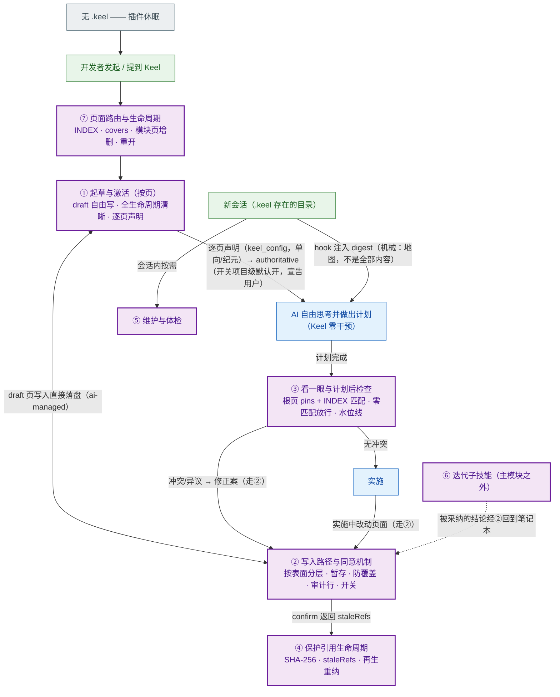
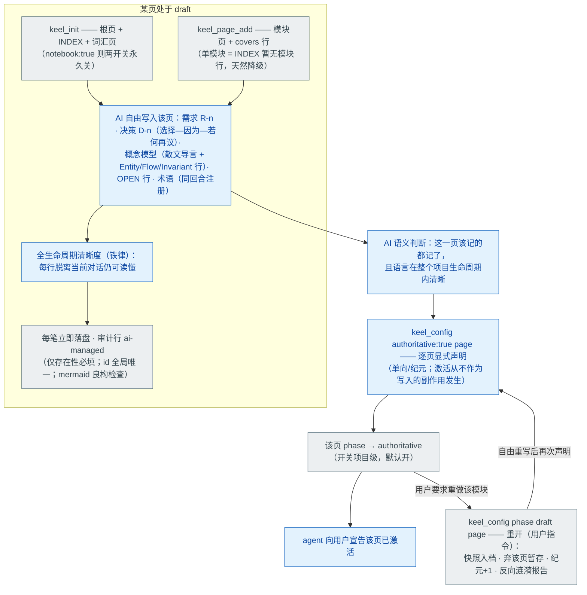
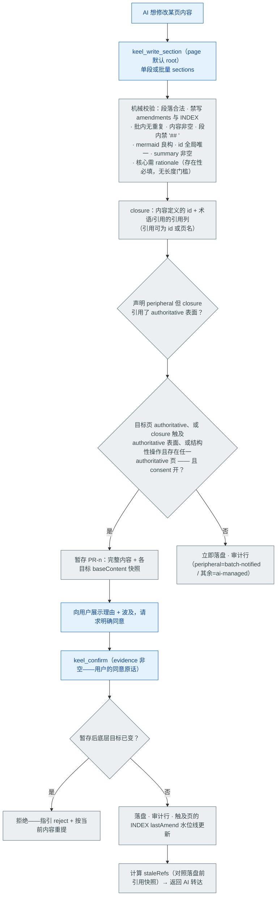
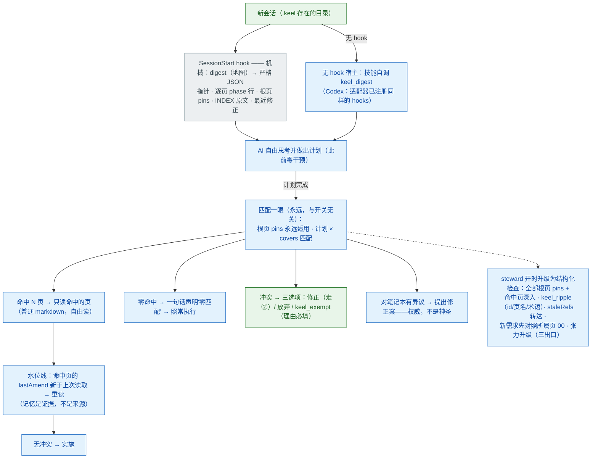
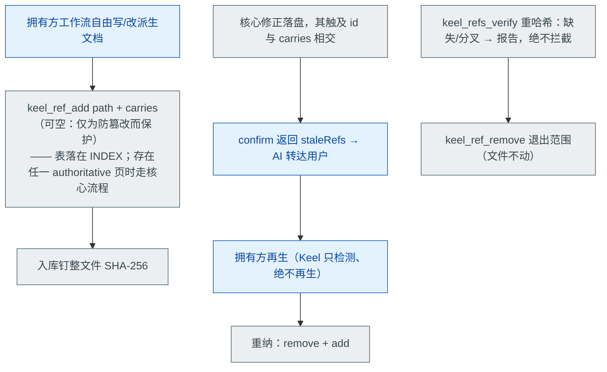
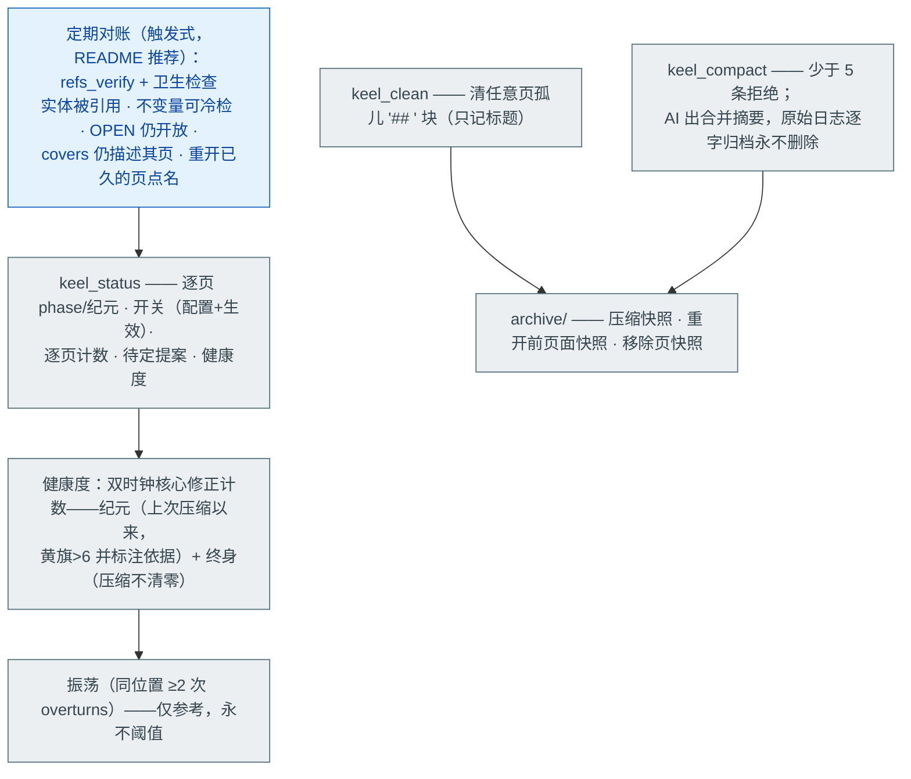
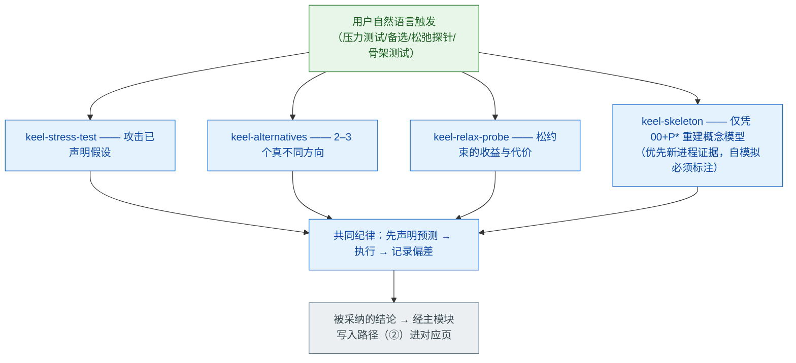
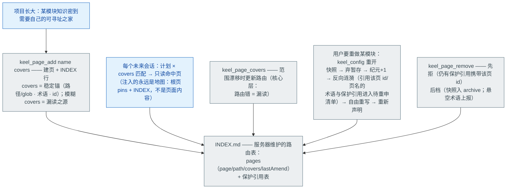

# Keel —— 全流程心智模型

> **一句话。** Keel 是 AI 的权威笔记本：一组只能经服务器写入的页面（根 DATUM + 模块页 + 全局词汇表），由 INDEX 路由、digest 注入，防止跨会话的主题遗忘与静默漂移；AI 自由思考、自由计划，只在实施前"匹配一眼"。

**文档契约。** 本文件是 Keel 的*心智模型*：开发者视角的全流程图景。它是派生文档——真源是代码（`mcp/server.js`、`skills/`、`hooks/`）与 `docs/PROTOCOL.md`；若本文件与它们冲突，**代码赢，本文件修**。对应 **Keel v2.3.0**。

---

## 0. 怎么读这份文件

### 0.1 总-分结构

§1 的总图是常驻层——完整流程一图可见；可模块化部分抽为分图①–⑦，在总图中各占一个紫色节点。紫节点 = "此处放大见对应分图"，编号即桥。总图只画已存在的流程。

### 0.2 颜色与线型规则

| 视觉 | 含义 |
|---|---|
| **绿色** | 开发者可感知——人会读到、决定或输入的步骤 |
| **蓝色** | AI 行为——受提示词驱动的判断与产出 |
| **灰色** | 纯机械——服务器代码或 hook，每次执行完全相同 |
| **紫色** | 分图入口 |
| 实线箭头 | 已存在 |

```mermaid
flowchart LR
    A["绿 = 开发者"]:::human --> B["蓝 = AI"]:::ai --> C["灰 = 机械"]:::mech --> P["紫 = 分图入口"]:::mod
    classDef human fill:#e8f5e9,stroke:#2e7d32,color:#1b5e20
    classDef ai fill:#e3f2fd,stroke:#1565c0,color:#0d47a1
    classDef mech fill:#eceff1,stroke:#546e7a,color:#37474f
    classDef mod fill:#f3e5f5,stroke:#6a1b9a,color:#4a148c,stroke-width:2px
```

### 0.3 先泼五盆冷水

1. **误会：注入的 digest 是给你看的。** 它给 *agent*——根页 pins + INDEX 原文是"地图"，agent 按图索骥只读命中的页。你的界面是对话。
2. **误会：consent 关了就没保护了。** 每笔写入仍记审计行（`ai-managed`）；丢掉的只是"等你点头"，不是记录。
3. **误会：激活（authoritative）是全项目一刀切。** phase 按页算：orders 页已声明 authoritative、auth 页仍是 draft，完全合法——完整模块先入设计期、未完成模块继续自由写，就是这条机制。
4. **误会：可以让 AI 手改文件。** 不行——所有 `.keel/` 写入走 `keel_*` 工具，服务器是唯一写入者（这是全部安全论证的根基）。读则完全自由：笔记本就是普通 markdown。
5. **误会：covers 写一次就一劳永逸。** 路由元数据会腐烂——代码搬家、页面改主题后 covers 说的和页面管的不再是同一回事，漏读从此无感。定期对账（steward 的 periodic audit）就是为它准备的。

---

## 1. 总图（常驻层）

```mermaid
flowchart TD
    DORM["无 .keel —— 插件休眠"]:::mech
    START["开发者发起 / 提到 Keel"]:::human
    M7["⑦ 页面路由与生命周期<br/>INDEX · covers · 模块页增删 · 重开"]:::mod
    M1["① 起草与激活（按页）<br/>draft 自由写 · 全生命周期清晰 · 逐页声明"]:::mod
    M2["② 写入路径与同意机制<br/>按表面分层 · 暂存 · 防覆盖 · 审计行 · 开关"]:::mod
    WORK["AI 自由思考并做出计划<br/>（Keel 零干预）"]:::ai
    M3["③ 看一眼与计划后检查<br/>根页 pins + INDEX 匹配 · 零匹配放行 · 水位线"]:::mod
    IMPL["实施"]:::ai
    SESSION["新会话（.keel 存在的目录）"]:::human
    M4["④ 保护引用生命周期<br/>SHA-256 · staleRefs · 再生重纳"]:::mod
    M5["⑤ 维护与体检"]:::mod
    M6["⑥ 迭代子技能（主模块之外）"]:::mod

    DORM --> START --> M7
    M7 --> M1
    M1 -->|"逐页声明（keel_config，单向/纪元）→ authoritative<br/>（开关项目级默认开，宣告用户）"| WORK
    M1 <-->|"draft 页写入直接落盘（ai-managed）"| M2
    WORK -->|"计划完成"| M3
    M3 -->|"无冲突"| IMPL
    M3 -->|"冲突/异议 → 修正案（走②）"| M2
    IMPL -->|"实施中改动页面（走②）"| M2
    M2 -->|"confirm 返回 staleRefs"| M4
    SESSION -->|"hook 注入 digest（机械：地图，不是全部内容）"| WORK
    SESSION -->|"会话内按需"| M5
    M6 -.->|"被采纳的结论经②回到笔记本"| M2
    classDef human fill:#e8f5e9,stroke:#2e7d32,color:#1b5e20
    classDef ai fill:#e3f2fd,stroke:#1565c0,color:#0d47a1
    classDef mech fill:#eceff1,stroke:#546e7a,color:#37474f
    classDef mod fill:#f3e5f5,stroke:#6a1b9a,color:#4a148c,stroke-width:2px
```

Keel 的形状是一个**环**——自由思考 → 计划 → 匹配一眼 → 实施 → 修正案 → 回到思考。守护只发生在一个接缝上（③），记录只发生在一个通道上（②），路由只发生在一个表面（⑦ 的 INDEX）。

---

## 2. 分图①：起草与激活（按页）

```mermaid
flowchart TD
    subgraph D["某页处于 draft"]
    INIT["keel_init —— 根页 + INDEX + 词汇页<br/>（notebook:true 则两开关永久关）"]:::mech
    PADD["keel_page_add —— 模块页 + covers 行<br/>（单模块 = INDEX 暂无模块行，天然降级）"]:::mech
    FREE["AI 自由写入该页：需求 R-n · 决策 D-n（选择—因为—若何再议）·<br/>概念模型（散文导言 + Entity/Flow/Invariant 行）· OPEN 行 · 术语（同回合注册）"]:::ai
    CLEAR["全生命周期清晰度（铁律）：每行脱离当前对话仍可读懂"]:::ai
    LOGD["每笔立即落盘 · 审计行 ai-managed<br/>（仅存在性必填；id 全局唯一；mermaid 良构检查）"]:::mech
    end
    JUDGE["AI 语义判断：这一页该记的都记了，<br/>且语言在整个项目生命周期内清晰"]:::ai
    DECLARE["keel_config authoritative:true page —— 逐页显式声明<br/>（单向/纪元；激活从不作为写入的副作用发生）"]:::ai
    ACT["该页 phase → authoritative（开关项目级，默认开）"]:::mech
    TELL["agent 向用户宣告该页已激活"]:::ai
    REOPEN["keel_config phase draft page —— 重开（用户指令）：<br/>快照入档 · 弃该页暂存 · 纪元+1 · 反向涟漪报告"]:::mech

    INIT --> FREE
    PADD --> FREE
    FREE --> CLEAR --> LOGD
    FREE --> JUDGE --> DECLARE --> ACT --> TELL
    ACT -->|"用户要求重做该模块"| REOPEN
    REOPEN -->|"自由重写后再次声明"| DECLARE
    classDef human fill:#e8f5e9,stroke:#2e7d32,color:#1b5e20
    classDef ai fill:#e3f2fd,stroke:#1565c0,color:#0d47a1
    classDef mech fill:#eceff1,stroke:#546e7a,color:#37474f
```

激活是 **AI 的语义判断 + 一次显式、可归因的声明**，判据按页；误激活的代价封顶——激活所开启的一切本来就各自可关，且毒不到别的页。重开不清零：旧内容仍是最好的草稿，各行线的命运（复写/推翻/弃用）在重写中逐行决定，reset 行是编年里的纪元边界。

---

## 3. 分图②：写入路径与同意机制（横切所有阶段）

```mermaid
flowchart TD
    WANT["AI 想修改某页内容"]:::ai
    CALL["keel_write_section（page 默认 root）<br/>单段或批量 sections"]:::ai
    VAL["机械校验：段落合法 · 禁写 amendments 与 INDEX<br/>· 批内无重复 · 内容非空 · 段内禁 '## '<br/>· mermaid 良构 · id 全局唯一 · summary 非空<br/>· 核心需 rationale（存在性必填，无长度门槛）"]:::mech
    CLOS["closure：内容定义的 id + 术语/引用的引用列<br/>（引用可为 id 或页名）"]:::mech
    ESC{"声明 peripheral 但 closure<br/>引用了 authoritative 表面？"}:::mech
    GATE{"目标页 authoritative、或 closure 触及<br/>authoritative 表面、或结构性操作且存在任一<br/>authoritative 页 —— 且 consent 开？"}:::mech
    STAGE["暂存 PR-n：完整内容 + 各目标 baseContent 快照"]:::mech
    SHOW["向用户展示理由 + 波及，请求明确同意"]:::ai
    CONFIRM["keel_confirm（evidence 非空——用户的同意原话）"]:::ai
    CLOB{"暂存后底层目标已变？"}:::mech
    CLOBERR["拒绝——指引 reject + 按当前内容重提"]:::mech
    APPLY2["落盘 · 审计行 · 触及页的 INDEX lastAmend 水位线更新"]:::mech
    STALE["计算 staleRefs（对照落盘前引用快照）→ 返回 AI 转达"]:::mech
    APPLY["立即落盘 · 审计行（peripheral=batch-notified / 其余=ai-managed）"]:::mech

    WANT --> CALL --> VAL --> CLOS --> ESC --> GATE
    GATE -->|"否"| APPLY
    GATE -->|"是"| STAGE --> SHOW --> CONFIRM --> CLOB
    CLOB -->|"是"| CLOBERR
    CLOB -->|"否"| APPLY2 --> STALE
    classDef human fill:#e8f5e9,stroke:#2e7d32,color:#1b5e20
    classDef ai fill:#e3f2fd,stroke:#1565c0,color:#0d47a1
    classDef mech fill:#eceff1,stroke:#546e7a,color:#37474f
```

要点：批量 = 一次逻辑变更一次同意一行审计；同意经济——先暂存，closure 为空且用户逐字指定改动时原话即证据；术语与保护引用的层级**随被引表面走**（引用 authoritative 页的 id/页名 → 核心）。结构性操作（页面增删/covers、引用增删）移动守护或路由边界：存在任一 authoritative 页且 consent 开时暂存；全 draft 项目天然零摩擦。写入路径中**没有任何数值门禁，也不触发激活**。

---

## 4. 分图③：看一眼与计划后检查（含会话自举）

```mermaid
flowchart TD
    SESS["新会话（.keel 存在的目录）"]:::human
    HOOK["SessionStart hook —— 机械：digest（地图）→ 严格 JSON<br/>指针 · 逐页 phase 行 · 根页 pins · INDEX 原文 · 最近修正"]:::mech
    FALL["无 hook 宿主：技能自调 keel_digest<br/>（Codex：适配器已注册同样的 hooks）"]:::ai
    PLAN["AI 自由思考并做出计划（此前零干预）"]:::ai
    GLANCE["匹配一眼（永远，与开关无关）：<br/>根页 pins 永远适用 · 计划 × covers 匹配"]:::ai
    MATCH["命中 N 页 → 只读命中的页（普通 markdown，自由读）"]:::ai
    ZERO["零命中 → 一句话声明'零匹配' → 照常执行"]:::ai
    WMARK["水位线：命中页的 lastAmend 新于上次读取 → 重读<br/>（记忆是证据，不是来源）"]:::ai
    OK["无冲突 → 实施"]:::ai
    OPT["冲突 → 三选项：修正（走②）/ 放弃 / keel_exempt（理由必填）"]:::human
    DIS["对笔记本有异议 → 提出修正案——权威，不是神圣"]:::ai
    STRUCT["steward 开时升级为结构化检查：全部根页 pins +<br/>命中页深入 · keel_ripple（id/页名/术语）· staleRefs 转达 ·<br/>新需求先对照所属页 00 · 张力升级（三出口）"]:::ai

    SESS --> HOOK
    SESS -->|"无 hook"| FALL
    HOOK --> PLAN
    FALL --> PLAN
    PLAN -->|"计划完成"| GLANCE
    GLANCE --> MATCH
    GLANCE --> ZERO
    MATCH --> WMARK --> OK
    GLANCE --> OPT
    GLANCE --> DIS
    GLANCE -.-> STRUCT
    classDef human fill:#e8f5e9,stroke:#2e7d32,color:#1b5e20
    classDef ai fill:#e3f2fd,stroke:#1565c0,color:#0d47a1
    classDef mech fill:#eceff1,stroke:#546e7a,color:#37474f
```

PostToolUse hook 在每次 keel_confirm 后刷新注入——长会话无需重启即跟踪设计。根页 pins 之所以无条件注入：违反它们的会话恰恰是**自认为无关的会话**（例：改 UI 的会话加上云端字体加载器，撞上"运行期零网络依赖"）。

---

## 5. 分图④：保护引用生命周期

```mermaid
flowchart TD
    WRITE["拥有方工作流自由写/改派生文档"]:::ai
    ADMIT["keel_ref_add path + carries（可空：仅为防篡改而保护）<br/>—— 表落在 INDEX；存在任一 authoritative 页时走核心流程"]:::mech
    PIN["入库钉整文件 SHA-256"]:::mech
    LANDS["核心修正落盘，其触及 id 与 carries 相交"]:::mech
    STALE2["confirm 返回 staleRefs → AI 转达用户"]:::ai
    REGEN["拥有方再生（Keel 只检测、绝不再生）"]:::ai
    READMIT["重纳：remove + add"]:::mech
    VERIFY["keel_refs_verify 重哈希：缺失/分叉 → 报告，绝不拦截"]:::mech
    REMOVE["keel_ref_remove 退出范围（文件不动）"]:::mech

    WRITE --> ADMIT --> PIN
    LANDS --> STALE2 --> REGEN --> READMIT
    VERIFY --> REMOVE
    classDef human fill:#e8f5e9,stroke:#2e7d32,color:#1b5e20
    classDef ai fill:#e3f2fd,stroke:#1565c0,color:#0d47a1
    classDef mech fill:#eceff1,stroke:#546e7a,color:#37474f
```

---

## 6. 分图⑤：维护与体检

```mermaid
flowchart TD
    STATUS["keel_status —— 逐页 phase/纪元 · 开关（配置+生效）·<br/>逐页计数 · 待定提案 · 健康度"]:::mech
    HEALTH["健康度：双时钟核心修正计数——纪元（上次压缩以来，<br/>黄旗>6 并标注依据）+ 终身（压缩不清零）"]:::mech
    OSC["振荡（同位置 ≥2 次 overturns）——仅参考，永不阈值"]:::mech
    AUDIT["定期对账（触发式，README 推荐）：refs_verify + 卫生检查<br/>实体被引用 · 不变量可冷检 · OPEN 仍开放 ·<br/>covers 仍描述其页 · 重开已久的页点名"]:::ai
    CLEAN["keel_clean —— 清任意页孤儿 '## ' 块（只记标题）"]:::mech
    COMPACT["keel_compact —— 少于 5 条拒绝；<br/>AI 出合并摘要，原始日志逐字归档永不删除"]:::mech
    ARCH["archive/ —— 压缩快照 · 重开前页面快照 · 移除页快照"]:::mech

    STATUS --> HEALTH --> OSC
    AUDIT --> STATUS
    CLEAN --> ARCH
    COMPACT --> ARCH
    classDef mech fill:#eceff1,stroke:#546e7a,color:#37474f
    classDef ai fill:#e3f2fd,stroke:#1565c0,color:#0d47a1
```

---

## 7. 分图⑥：迭代子技能（主模块之外）

```mermaid
flowchart TD
    ASK["用户自然语言触发<br/>（压力测试/备选/松弛探针/骨架测试）"]:::human
    ST["keel-stress-test —— 攻击已声明假设"]:::ai
    ALT["keel-alternatives —— 2–3 个真不同方向"]:::ai
    RELAX["keel-relax-probe —— 松约束的收益与代价"]:::ai
    SKEL["keel-skeleton —— 仅凭 00+P* 重建概念模型<br/>（优先新进程证据，自模拟必须标注）"]:::ai
    PRED["共同纪律：先声明预测 → 执行 → 记录偏差"]:::ai
    BACK["被采纳的结论 → 经主模块写入路径（②）进对应页"]:::mech

    ASK --> ST & ALT & RELAX & SKEL --> PRED --> BACK
    classDef human fill:#e8f5e9,stroke:#2e7d32,color:#1b5e20
    classDef ai fill:#e3f2fd,stroke:#1565c0,color:#0d47a1
    classDef mech fill:#eceff1,stroke:#546e7a,color:#37474f
```

四个子技能有无笔记本都可用（skeleton 需要有）；对笔记本只读 + 经②写回，从不绕过。

---

## 8. 分图⑦：页面路由与生命周期（多模块）

```mermaid
flowchart TD
    GROW["项目长大：某模块知识密到需要自己的可寻址之家"]:::ai
    PADD2["keel_page_add name covers —— 建页 + INDEX 行<br/>covers = 稳定锚（路径/glob · 术语 · id）；模糊 covers = 漏读之源"]:::mech
    ROUTE["每个未来会话：计划 × covers 匹配 → 只读命中页<br/>（注入的永远是地图：根页 pins + INDEX，不是页面内容）"]:::ai
    COVERS["keel_page_covers —— 范围漂移时更新路由（核心层：<br/>路由错 = 漏读）"]:::mech
    REWORK["用户要重做某模块：keel_config 重开<br/>快照 → 弃暂存 → 纪元+1 → 反向涟漪（引用该页 id/页名的<br/>术语与保护引用进入待重申清单）→ 自由重写 → 重新声明"]:::mech
    PREMOVE["keel_page_remove —— 先拒（仍有保护引用携带该页 id）<br/>后档（快照入 archive；悬空术语上报）"]:::mech
    INDEX["INDEX.md —— 服务器维护的路由表：<br/>pages（page/path/covers/lastAmend）+ 保护引用表"]:::mech

    GROW --> PADD2 --> INDEX
    ROUTE --> INDEX
    COVERS --> INDEX
    REWORK --> INDEX
    PREMOVE --> INDEX
    classDef human fill:#e8f5e9,stroke:#2e7d32,color:#1b5e20
    classDef ai fill:#e3f2fd,stroke:#1565c0,color:#0d47a1
    classDef mech fill:#eceff1,stroke:#546e7a,color:#37474f
```

**单模块 = INDEX 里还没有模块行的多模块**——没有模式开关、没有迁移，加页即升级，从第一天起就是这个形态。升级判据：模块知识密到值得独立寻址；边界还在流变就留在根页。安全网：读路由漏判 → 写门禁兜底（错误计划在写入时撞上 authoritative 页）。

---

## 9. Mermaid 装不下的常量与规则

- **引用词汇**：claim id 正则 `^(P|R|D)\d+$`（全局唯一，服务器拒绝跨页冲突）；页名正则 `^[a-z][a-z0-9-]{0,31}$`；术语/引用的引用列可写 id 或页名。**数值写入门禁：无**——仅存在性必填：summary · 核心 rationale · consent 证据 · 豁免理由（审计行引前 40 字）。维护层的两个数字：少于 5 条拒绝压缩；纪元核心修正 >6 亮黄旗（纯提示，不拦截）。mermaid 良构检查：围栏闭合 + 括号/引号配平（fail-open，仅语法）。
- **18 个工具**：init · digest · status · ripple · write_section（page 参数）· confirm · reject · config（逐页声明/重开 + 开关）· glossary_register · ref_add · ref_remove · refs_verify · page_add · page_remove · page_covers · clean · compact · exempt。
- **digest 组成**：指针 · 逐页 phase 行 · 根页 pins（Goal/Out of scope/Success/R-n/P-n/Invariant/Decision 行）· INDEX 原文（pages 表 + 保护引用）· 最近 3 条修正 · 习惯行（零匹配 + 记忆是证据）。
- **保护引用默认 id**：`REF1..`；carries 可空（仅为防篡改而保护）。
- **谁能动什么**：开发者——只在对话里说同意原话；AI——只调 `keel_*`；服务器——`.keel/` 唯一写入者（读则完全自由）。state.json 只经工具改；keel_status 是它的视图。
- **宿主面事实**：插件 MCP = `<pluginRoot>/.mcp.json`（`plugin:keel:keel`）；hook stdout 必须严格 JSON；hook 从载荷 `cwd` 解析项目目录；插件路径锚 `${CLAUDE_PLUGIN_ROOT}`；Codex 经 `~/.codex/hooks.json` 注册同样的 hooks（一次性 `/hooks` 信任）；发布门禁 = hostcompat + smoke。
- **失败模式出口**：暂存遗弃 → status 可见 + reject · 孤儿块 → clean · 引用漂移 → verify 报告 + 再生重纳 · state.json 损坏 → 保守默认（全部 draft），AMENDMENTS.md 是持久历史 · 过早声明 → 最多多几轮同意回合，且按页封顶 · covers 腐烂 → 定期对账点名 + 写门禁兜底 · 重开忘关 → reset 行在对账中点名。
